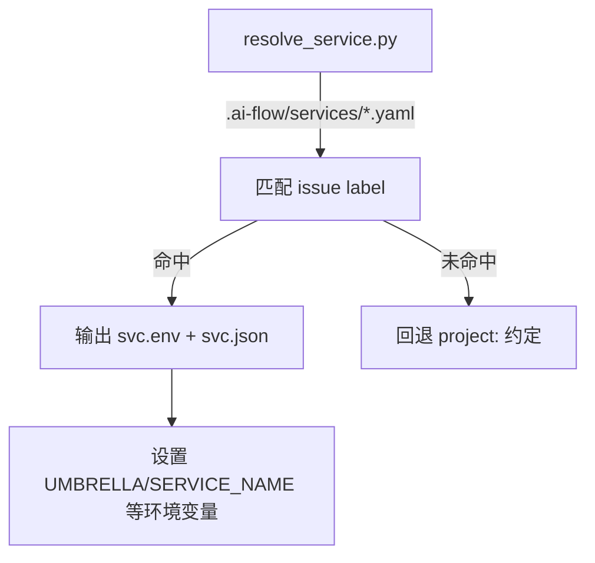
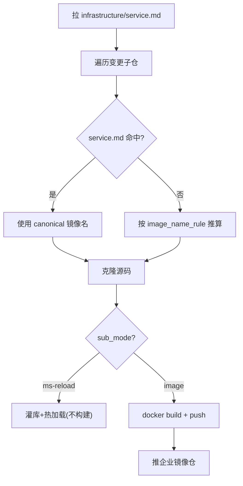
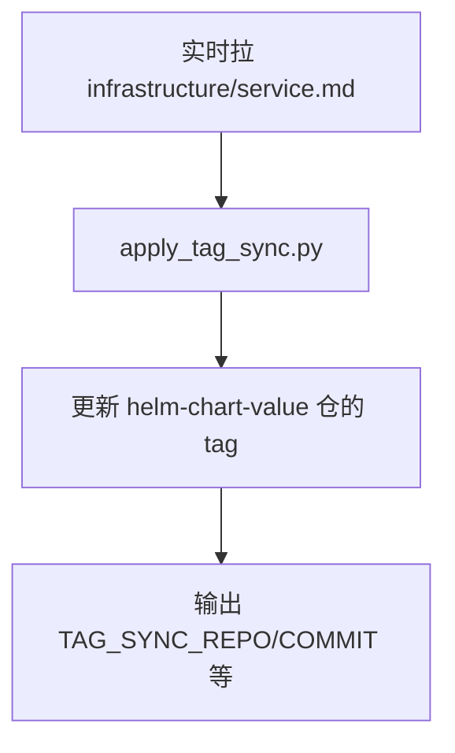
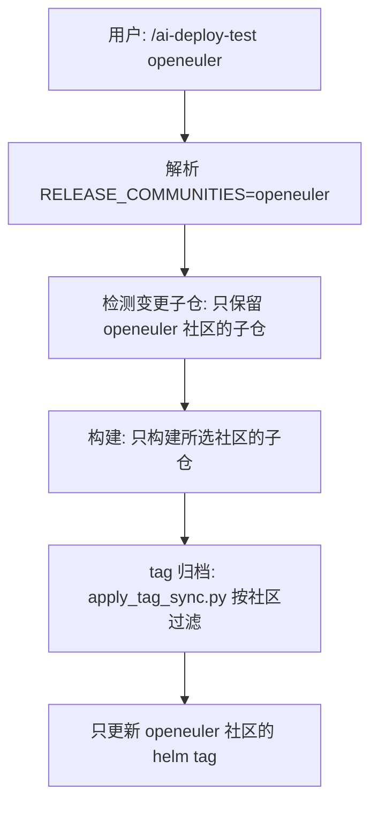

---
tags:
  - ai-flow
  - backlog
  - 发布
  - 架构
---

# backlog issue-3-release.yml 架构解读

> 解读时间：2026-06-17
> 文件路径：`.github/workflows/issue-3-release.yml`
> 总行数：1113 行

## 一、整体定位

`issue-3-release.yml` 是 backlog 仓库的**测试环境发布**工作流（第 4 阶段），对应命令 `/ai-deploy-test`。它是五阶段生命周期中最复杂的 workflow，涵盖构建、部署、测试、归档全链路。

```mermaid
flowchart LR
    A["/ai-deploy-test"] --> B["command-router.yml"]
    B -->|workflow_dispatch| C["issue-3-release.yml"]
    C --> D["路由服务"]
    D --> E["前置校验"]
    E --> F["检测变更子仓"]
    F --> G["构建镜像 + 推 SWR"]
    G --> H["GitOps tag 归档"]
    H --> I["部署校验(ArgoCD)"]
    I --> J["集成测试"]
    J --> K["测试报告 PR"]
    K --> L["pre-release"]
    L --> M["回评 Issue"]
```

## 二、触发方式

- **唯一入口**：`workflow_dispatch`，由 `command-router.yml` 解析 `/ai-deploy-test` 后触发
- **不直接监听** `issue_comment`（消除 skipped 噪音，#557 改进）
- **并发控制**：`concurrency: release-${{ inputs.issue_number }}`，同一 issue 串行执行

### 输入参数

| 参数 | 说明 |
|------|------|
| `issue_number` | 需求 issue 号（必填）|
| `comment_body` | 触发评论原文，含阶段/社区参数 |
| `issue_title` | issue 标题（PR 误评重定向用）|
| `issue_labels` | issue 标签（服务路由用）|
| `comment_author` | 评论者 GitHub login（提交身份用）|

### `/ai-deploy-test` 参数解析（行 117-160）

| 参数 | 说明 |
|------|------|
| 无参 | 全流程：构建 → tag归档 → 部署 → 集成测试 → 报告 → pre-release |
| `force` | 强制重发，忽略 no-change 检测 |
| `full` | 发布聚合仓下全部子服务（含无变更的），隐含 force |
| `build` | 只构建+推镜像+更新 helm tag |
| `tagsync` | 只更新 helm tag |
| `deploy` | 只部署校验 |
| `it` / `in-test` | 只重跑集成测试 |
| `report` | 只出测试报告 |
| `prerelease` | 只打 pre-release |
| `<社区名>` | 只发布指定社区的归档目标 |

**社区名硬编码列表**（行 145）：`ascend openeuler openubmc cann mindspore boostkit hpckit openfuyao opengauss openjiuwen openpangu hifloat unifiedbus openlookeng xihe`

## 三、核心步骤详解

### Step 1：护栏 — PR 误评拦截（行 75-100）

防止用户在 PR 上评论 `/ai-deploy-test`。如果 `issue.pull_request != null`，回评提示用户去需求 issue 上操作。

### Step 2：阶段参数解析（行 101-160）

解析 `/ai-deploy-test` 后的阶段关键词和社区路由，写入 `GITHUB_ENV`：
- `STAGE_BUILD`、`STAGE_TAGSYNC`、`STAGE_DEPLOY` 等布尔标记
- `RELEASE_COMMUNITIES`：社区过滤列表
- `FORCE_PUBLISH`、`PUBLISH_ALL`：force/full 模式标记

### Step 3：服务路由（行 195-244）

- 通过 `.ai-flow/services/` 下的 YAML 注册表按 issue label 匹配目标服务
- 生成版本号：`v1.0.$(date +%Y%m%d%H%M%S)`
- 克隆 `agent-development-specification` 仓库为 `.spec`（读取 deploy-tester agent 角色定义）

### Step 4：克隆 umbrella + SWR 登录（行 246-267）

- 克隆聚合仓（含 submodules）
- 构建「构建单元」清单 `subpaths.txt`，格式 `smpath|repo|sub`
- 单仓服务（无 `.gitmodules`）：仓自身为唯一构建单元，强制 `image_name_rule=sub`

### Step 5：前置校验（行 269-291）

检查是否有未合入的实现 PR。如果有，阻断发布并回评 issue。

### Step 6：检测变更子仓（行 293-339）

- 遍历 subpaths，查找有已合入 `issue-N-*` 分支名 PR 的子仓
- **社区过滤**：有指定社区时，从 `svc.json` 的 `tag_sync` 配置提取该社区包含的子仓列表，跳过不属于的子仓
- **full 模式**：把聚合仓下未变更但在社区范围内的子仓也纳入

### Step 7：构建镜像 + 推 SWR（行 425-600+）

这是最复杂的步骤，核心逻辑：

**关键细节**：
- **service.md 查询**（行 433-436）：从 `${{ github.repository_owner }}/infrastructure/contents/service.md` 拉取（即 **`opensourceways/infrastructure`**），用 `lookup_image_from_service_md.py` 查 canonical 镜像名
- **构建分支**：默认用 main HEAD；per-sub 可配 `build_ref` 使用专属分支
- **tag 规则**：`version`（打 git tag 用 tag 代码）或 `branch-sha`（直接用分支代码）
- **ms-reload 模式**：只改接口定义时，走灌库+热加载，不构建镜像

### Step 8：GitOps tag 归档（行 638-661）

- **再次拉取 service.md**（行 646-655）：`opensourceways/infrastructure/service.md`
- 拉失败时回退到 svc.json 中的静态 yaml 归档目标
- `apply_tag_sync.py` 按社区路由过滤，逐社区更新 helm tag

### Step 9：部署校验 — ArgoCD 轮询（行 663-759）

- **ArgoCD 模式**：通过 Jenkins 获取测试环境 kubeconfig，轮询 deployment 镜像 tag 是否切换完成
- **deployment 名解析**：优先 service.md col[1]（#448 教训：sub 名 ≠ deployment 名时错位）
- **超时**：默认 8 分钟，超时标 ⚠️ 但不阻断
- **非 ArgoCD 模式**：直接跳过（issue-3 不做部署动作）

### Step 10：集成测试（行 761-788）

- `continue-on-error: true`：best-effort，失败不阻断
- 调用 `run_integration_tests.py`，统计 ✅/❌ 计数

### Step 11：测试报告 PR（行 790-924）

- 渲染模板生成测试报告 `issue_docs/{N}/Test/#{N} Test Report.md`
- 创建/更新 PR 到 main 分支
- 报告包含：部署结果、镜像列表、tag 归档、集成测试结果、最终结论

### Step 12：pre-release（行 926-974）

为每个变更的服务仓创建 GitHub pre-release：
- 标题：`{VERSION} · {repo}（测试环境）`
- 内容：表格（版本、镜像、tag commit、测试报告链接等）

### Step 13：回评 Issue（行 976-1113）

- **失败**：发失败通知，提示查看日志
- **成功**：发布完成摘要，含镜像列表、部署状态、测试结果、下一步指引

## 四、service.md 使用方式（与用户问题相关）

本 workflow 中 **两处** 拉取 `infrastructure/service.md`：

| 位置 | 行号 | 用途 | 仓库 |
|------|------|------|------|
| 构建阶段 | 433-436 | 查 canonical 镜像名（覆盖推算值）| `opensourceways/infrastructure` |
| tag 归档阶段 | 646-655 | helm 归档目标（覆盖静态 yaml）| `opensourceways/infrastructure` |

两处都使用 `${{ github.repository_owner }}/infrastructure`，由于 backlog 仓属于 `opensourceways` 组织，所以解析为 `opensourceways/infrastructure`。

**与 release-mgmt 的差异**：release-mgmt 中的 `/ai-release-plan create` workflow 调用 AI agent（glm-5），AI agent 自主决定查询了 `agentic-develop-playground/infrastructure`（错误的仓库），导致变更计划说明书中只列出了 openubmc 社区。

## 五、社区路由机制

社区路由贯穿整个 workflow：
1. **参数解析**（行 142-154）：从命令参数识别社区名
2. **变更检测**（行 293-339）：从 svc.json 的 tag_sync 配置提取社区包含的子仓，过滤不属于的
3. **tag 归档**（行 657-659）：`apply_tag_sync.py` 接收 `SERVICE_MD` 环境变量，按社区过滤
4. **部署校验**（行 697-703）：分主部署/独立部署（separate_deploy）

## 六、关键设计模式

### 1. 改了谁发谁

遍历 umbrella 的 submodules，只构建有已合入 `issue-N-*` PR 的子仓，未变更的跳过。

### 2. full 模式扩展

`/ai-deploy-test full` 把聚合仓下所有子仓都纳入，无合入 PR 的从默认分支重建。

### 3. ms-reload 热加载

当子仓的 sub_mode 配置为 `ms-reload`，且本次合入 PR 只改了 `reload_exts`（如 `.ms` 文件），直接灌库+热加载，不构建镜像。

### 4. service.md 实时查询

不依赖静态 YAML 配置，而是实时从 `infrastructure/service.md` 获取镜像名和 helm 归档目标，避免手抄过时。

### 5. 优雅降级

- service.md 拉失败 → 回退推算值
- kubeconfig 获取失败 → 跳过现网校验
- 集成测试失败 → 不阻断后续步骤
- PR 创建失败 → 回退查已有 PR

## 七、环境变量清单（关键）

| 变量 | 来源 | 说明 |
|------|------|------|
| `UMBRELLA` | svc.env | 聚合仓名 |
| `SERVICE_NAME` | svc.env | 服务显示名 |
| `VERSION` | 自动生成 | `v1.0.{timestamp}` |
| `RELEASE_COMMUNITIES` | 参数解析 | 社区过滤列表 |
| `RELEASE_DEPLOY` | svc.json | 部署模式(argocd/none) |
| `RELEASE_ARGOCD_CLUSTER` | svc.json | ArgoCD 集群名 |
| `RELEASE_ARGOCD_NAMESPACE` | svc.json | ArgoCD 命名空间 |
| `RELEASE_IMAGE_NAME_RULE` | svc.json | 镜像命名规则(sub/umbrella-sub) |
| `RELEASE_IMAGE_TAG_RULE` | svc.json | tag 规则(version/branch-sha) |

---

## 🔗 相关笔记

- [[backlog-architecture]] — backlog 工程架构总纲
- [[infrastructure-服务映射表]] — 发布强依赖 service.md
- [[术语解释]] — 发布相关术语

> 索引：[[ai-flow 体系]] · 返回 [[首页]]
