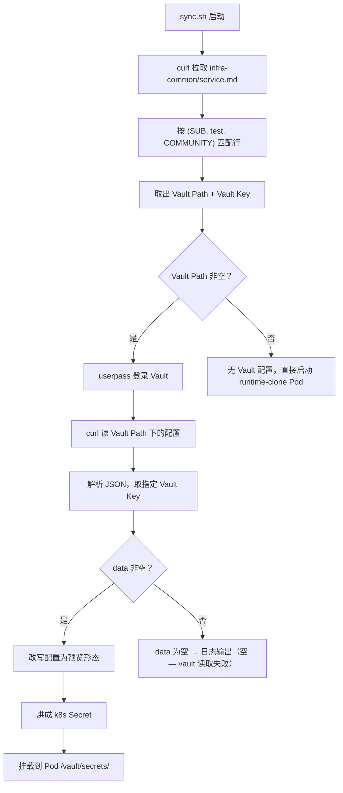

---
tags:
  - 基础设施
  - 服务映射
  - 知识
---

# service.md 字段详解 —— 基础设施服务映射表解读

> 解读时间：2026-06-09

---

## 一、这张表是干什么的

`infra-common/service.md` 是 openEuler 社区基础设施团队的**"服务部署档案总表"**。它记录每一条答案：

> 某个微服务的某个环境，源码在哪、配置在哪、部署在哪集群的哪个命名空间。

.ai-flow 的预览部署引擎（`sync.sh`）在启动预览环境时，会读这张表找到真实 test 环境的配置路径、然后从 Vault 拉取配置、改写为预览形态、注入预览 Pod。

---

## 二、字段解读

### 微服务

服务的唯一标识名称，比如 `meeting-center`、`robot-hook-dispatcher`。

在 .ai-flow 中，`sync.sh` 用 `(微服务名, "test", 社区名)` 三元组来匹配行、拿到后续所有字段。

需要注意的是同一个微服务可以有**多行**——每行对应一个环境。例如 `ascend-usercenter` 有两行（`prod` 和 `test`），两行的镜像、Vault Path、集群等完全不同。

### 环境

部署目标环境，取值为 `prod` / `test` / `staging`：

| 值 | 含义 | 谁用 |
|----|------|------|
| `prod` | 生产环境，面向真实用户 | 线上流量 |
| `test` | 测试环境，内部验证用 | `.ai-flow` 预览部署从这里取 Vault 配置作为"真配置基准" |
| `staging` | 预发布环境，上线前最后一关 | 暂无直接关联 |

`.ai-flow` 只关心 `test` 行——它读取 test 环境的 Vault Path/Vault Key，拉取真实配置，然后改写为预览形态（底座 DB 地址替换、DEBUG=true、域名替换）。

### 域名

服务对外暴露的公网地址，比如 `meeting.ascend.osinfra.cn`。

空值表示该服务**只在集群内部访问**（ClusterIP），不对外暴露。

在预览部署中，`sync.sh` 会把域名从生产域名（`.osinfra.cn`）改写成预览域名（`.preview.test.osinfra.cn`），确保预览请求走预览 ingress 入口。

### 镜像名

Docker 容器镜像的完整地址。格式：`<仓库地址>/<组织>/<镜像名>:<tag>`

例：`swr.cn-north-4.myhuaweicloud.com/opensourceway/meeting/meeting-center`

分层含义：

| 部分 | 含义 |
|------|------|
| `swr.cn-north-4.myhuaweicloud.com` | 华为云 SWR 镜像仓库（北京四区） |
| `opensourceway` | 组织命名空间 |
| `meeting/meeting-center` | 镜像名 |

**注意**：这个字段是指生产/测试环境的**最终部署镜像**。.ai-flow 预览不走这个镜像——预览用的是 `runtime-clone` 模式，Pod 启动后现场从 GitHub 拉代码、编译、运行。

### 镜像构建源码仓

构建这个镜像的 GitHub 源码仓库地址。

链接了"镜像"和"源码"的关系——CI/CD 流水线从这个仓库拉代码、用 Dockerfile 构建、推到镜像名对应的仓库。

### Vault Path

敏感配置在 HashiCorp Vault（密码保险柜）中的存储路径。

格式：`internal/data/<项目>/<路径>`

例：`internal/data/infra-test/ascend-backend-robot`

| 部分 | 含义 |
|------|------|
| `internal` | Vault 的 secrets engine 类型（KV v2） |
| `data` | 数据路径前缀 |
| `infra-test` | test 环境共用命名空间 |
| `ascend-backend-robot` | 具体服务的配置子路径 |

空或 `-` 表示这个服务没有敏感配置需要从 Vault 取。

**在 .ai-flow 中的使用**：

```
sync.sh 流程：
1. 从 service.md 查到 Vault Path = "internal/data/infra-test/xxx"
2. userpass 登录 Vault
3. curl "https://vault.preview.test.osinfra.cn/v1/internal/data/infra-test/xxx"
4. 取出 data.data 里的配置内容
5. 改写为预览形态 → 烘成 k8s Secret → 挂载到预览 Pod
```

### Vault Key

指定从 Vault Path 下取**哪些 key**。每个 key 对应一个配置文件片段。

常见取值：

| Key 名 | 典型内容 |
|--------|---------|
| `token` | API 访问凭证 |
| `ServerCrt, ServerKey` | HTTPS 证书和私钥 |
| `dbConfig` | 数据库连接字符串 |
| `platformConfig, platformSecrets` | Django/Flask 应用的 settings 配置 |
| `TestOsinfraCnPfx` | `.pfx` 格式的 SSL 证书包 |

`-` 表示该服务在 Vault 中无配置、不需要拉取。

**在 .ai-flow 中的使用**：`sync.sh` 的 `mapping` 字典把每个 Vault Key 映射为 Pod 内期望的文件名。例如：

```python
mapping = {"platformConfig": "secrets.yaml", "platformSecrets": "config"}
```

意思是：从 Vault 取出 `platformConfig` 的内容，写入文件 `secrets.yaml`，挂载到 Pod 的 `/vault/secrets/secrets.yaml`。

### 部署归档仓库

部署配置（k8s 的 Deployment/Service/Ingress 等 YAML 描述文件）的存放仓库。

两个主要仓库：

| 仓库 | 含义 |
|------|------|
| `opensourceways/infra-common` | 走 kustomize 方式管理的部署配置（CI 流程用 script 直接改写 yaml 字段） |
| `Open-Infra-Ops/helm-chart-value` | 走 Helm 方式管理的部署配置（values.yaml 驱动） |

### 部署归档子路径

在上述仓库里的具体目录路径。例：`ascend/meeting/prod`

路径按 `<项目>/<服务>/<环境>` 层级组织。

### 部署集群

部署到哪个 Kubernetes 集群。集群名规律：`<地域>-<用途>-<编号>`

| 示例 | 解读 |
|------|------|
| `infra-hk-test-cluster-001` | 香港·测试·1号集群 |
| `infra-bj-test-cluster-002` | 北京·测试·2号集群 |
| `ascend-guiyang-prod-cluster` | 贵阳·生产·Ascend专属集群 |

### 命名空间

k8s 集群内的逻辑隔离分区。同一集群内不同命名空间的服务互不干扰（网络隔离、资源配额独立）。

例：`ascend`、`ascend-robot`、`boostkit-meeting`

### ArgoCD域名

ArgoCD 的管理界面地址，如 `https://build-01.test.osinfra.cn`。

ArgoCD 是一个 **GitOps 工具**：你把部署配置推到 git，ArgoCD 自动检测变更并同步到 k8s 集群。这张表告诉 CI 流程"这个服务的 ArgoCD 实例在哪"。

### ArgoCD应用名

在 ArgoCD 中注册的应用名称。CI 流程用它来**触发 ArgoCD 同步**或**校验同步结果**。

### 构建脚本路径

Jenkins 构建任务配置文件在 `pipeline/` 目录中的相对路径。

例：`pipeline/helm-charts-ascend-robot-prod.txt`

CI 流程用这个脚本决定：怎么构建镜像、推到哪里、用什么 tag 策略。

### 镜像版本路径

镜像 tag（版本号）在部署配置文件中的**字段位置**。CI 流程发布新版本时，自动找到这个位置并改写成新 tag。

两种典型取值：

| 值 | 对应的部署方式 | 含义 |
|----|--------------|------|
| `.image.tag` | Helm | 改 Helm values 的 `.image.tag` 字段 |
| `.spec.template.spec.containers[0].image` | kustomize | 直接改写 k8s Deployment YAML 的第一个容器的 image 字段 |

### 归档方式

部署配置的管理方式，决定 CI 怎么找、怎么改部署配置文件。

| 值 | 全称 | 管理方式 | 镜像版本改写方式 |
|----|------|---------|----------------|
| `kustomize` | Kustomize | 基于 base + overlay 的 patch 叠加 | 用 script 直接 sed/jq 改写 YAML 字段 |
| `helm` | Helm Chart | 模板 + values.yaml 参数化 | 改 values.yaml 的对应字段 |

---

## 三、与 .ai-flow 预览部署的连接

整个预览部署流程中，service.md 的调用链如下：



关键节点说明：

1. **匹配行**：Python 解析 service.md 的 Markdown 表格，按 `cols[0]==SUB and cols[1]=='test'` 匹配
2. **Vault Path 非空**：检查匹配行第 6 列（Vault Path）是否为空或 `-`
3. **Vault 读取**：`curl -H "X-Vault-Token: $VTOKEN" https://vault.preview.test.osinfra.cn/v1/<VaultPath>`
4. **解析配置**：`json.loads(response)["data"]["data"]` 提取 key-value 字典
5. **改写**：`mapping` 字典指定 Vault key → 文件名映射，同时对 DB 块、DEBUG、域名做预览环境替换

---

## 🔗 相关笔记

- [[infrastructure-服务映射表]] — 映射表概要（互补）
- [[forum-reply-robot-ai-flow-vault]] — Vault 实操链路

> 索引：[[基础设施]] · 返回 [[首页]]
