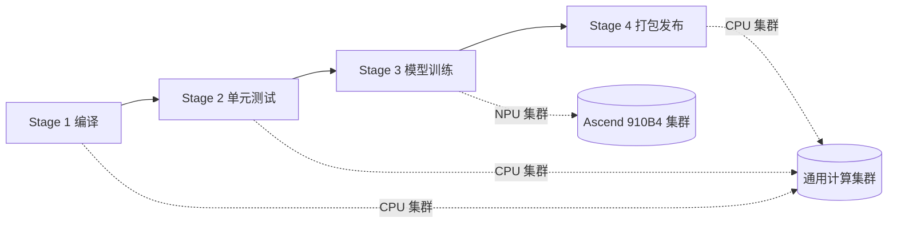

# Pipeline 实例：Ascend 模型训练流水线

## 流水线概览



## Stage 详情

| Stage | 作用 | CP_runs_on | 集群 | 关键配置 |
|-------|------|-----------|------|---------|
| **stage1-compile** | 编译 C++ 代码 | `amd64-cpu-8-mem-16G` | 通用 CPU | `CP_artifacts` 输出 .so 文件 |
| **stage2-test** | 运行单元测试 | `amd64-cpu-4-mem-8G` | 通用 CPU | 简单快速 |
| **stage3-train** | 多卡 NPU 训练 | `arm64-cpu-12-mem-48G-910b4-2` | Ascend NPU | `CP_dataset` PVC 挂载权重 + `CP_shm` + `CP_delay_exit` |
| **stage4-package** | 打包发布 | `amd64-cpu-4-mem-8G` | 通用 CPU | 拿上一阶段的产物打包 |

## 关键点说明

### 1. 不同 Stage 自动切换集群

Pipeline 引擎为每个 Stage 分别调用 `convert_to_yaml` → `submit`。Stage 1、2、4 的 `CP_runs_on` 不含 NPU → 发到通用 CPU 集群；Stage 3 指定了 `910b4` → 自动发到有 Ascend 芯片的集群。

全程不需要手动切 kubeconfig。

### 2. PVC 数据集挂载

Stage 3 的 `CP_dataset="/dataset/model-weights,readonly"` 让 converter：

- 自动在 Volcano Job YAML 中加上 PVC 卷声明
- 将 PVC 挂载到容器内的 `/dataset/model-weights`
- 给 Job 打上 `dispatch/<集群>=true` 标签，确保发到 PVC 所在集群

容器里 `/dataset/model-weights/checkpoint_latest.pt` 直接可用，零等待。

### 3. Stage 间产物传递

Stage 1 编译产物通过 `CP_artifacts` 输出到 `/output` 目录，Pipeline 平台负责在 Stage 间传递这些文件。Stage 3 的 `shell.sh` 从 `/workspace/build/` 读取上一阶段的 .so 文件。

### 4. 失败调试

Stage 3 的训练时间长、容易出错。`CP_delay_exit=60` 让容器在非零退出后 sleep 60 秒再关闭，给你时间 `kubectl exec` 进去排查。

### 5. 共享内存

多卡训练中 NCCL 通信需要大块共享内存，`CP_shm="32G"` 让 converter 自动给容器创建一个 32Gi 的 `/dev/shm` 卷。

## 每个 Stage 的实际产出

```
Stage 1 → Volcano Job (CPU集群) → /output/build/*.so, *.o
Stage 2 → Volcano Job (CPU集群) → 测试报告（stdout）
Stage 3 → Volcano Job (NPU集群) → /output/model_final.pt
Stage 4 → Volcano Job (CPU集群) → package.tar.gz
```
