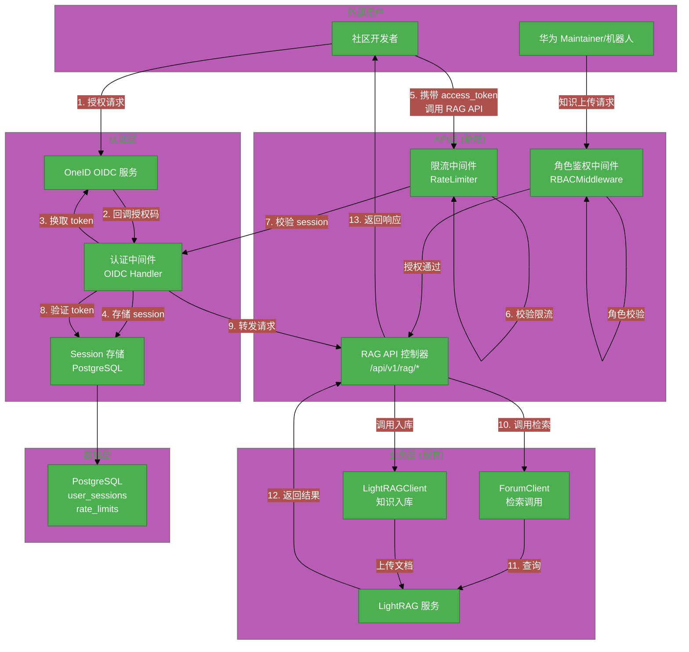
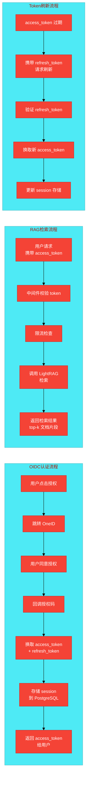
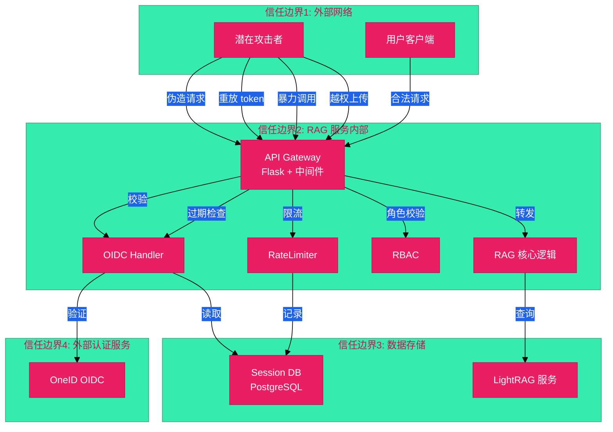

---
tags:
  - issue-921
  - 架构
  - RAG
  - forum-reply-robot
issue: 921
service: forum-reply-robot
---

# #921 openUBMC社区RAG对外查询接口架构设计说明书

---

## 模块归属

`module: forum-reply-robot`

---

## 1. 基础信息

- **需求链接**: https://github.com/opensourceways/backlog/issues/921
- **需求名称**: openUBMC社区RAG对外查询接口
- **开发责任人**: [TODO]
- **设计目标**: 在现有 forum-reply-robot 服务基础上新增 Web API 层，接入 OneID OIDC 认证，开放 RAG 检索接口供社区开发者调用，并支持授权角色上传知识文档。
- **实现状态**: 核心功能已完成开发并部署预览（详见各章节标注）

**本轮预览新增性能优化与安全增强**（issue-921-from-main 分支，基于用户反馈的性能与安全问题修复）：

**第一阶段（性能与架构优化）**：

- **数据库连接池**：引入 `psycopg2.pool.ThreadedConnectionPool`，高并发场景下复用数据库连接，避免频繁创建/销毁 TCP 连接带来的性能开销（`utils.py` 连接池管理函数、`auth_middleware.py` 和 `rate_limiter.py` 改用连接池）
- **state 安全机制简化**：简化 OIDC state 参数生成与校验逻辑，使用 `secrets.token_urlsafe(16)` 替代复杂的 UUID+时间戳+签名机制，依赖 Flask Session 的加密签名保证安全性（`oidc_client.py` 第 40-57 行）
- **HTTP 超时优化**：LightRAG 检索请求超时从 600 秒缩短至 30 秒，避免线程饥饿风险（`rag_api.py` 第 270 行）
- **路径穿越防护**：知识上传接口使用 `secure_filename` 安全过滤文件名，阻止 `../../` 等路径穿越攻击（`rag_api.py` 第 326-331 行）
- **用户ID稳定性**：从 OIDC id_token JWT 解析 `sub` claim 作为稳定 user_id，UserInfo 接口作为备用（`oidc_client.py` `_decode_id_token` / `_fetch_userinfo` 方法）
- **RBAC角色存储**：user_sessions 表新增 `roles` TEXT 字段，存储从 OIDC claims 提取的角色信息（`auth_middleware.py` 第 56、66、111、139 行）
- **Flask 3.x兼容性**：使用 `app.debug` 替代已移除的 `app.env` 属性，避免运行时崩溃（`external_api_app.py` 第 63 行）

**第二阶段（Bandit 安全扫描修复）**：

- **临时文件安全（B108 MEDIUM）**：修复 `rag_api.py:334` 硬编码 `/tmp` 路径问题，改用 `tempfile.NamedTemporaryFile(mode='wb', delete=False, suffix=f'_{safe_filename}')`，自动选择安全临时目录，符合最佳实践
- **MD5 hash 弱加密（B324 HIGH）**：修复 `rag_api.py:376` MD5 hash 用于生成 user_id 的问题，添加 `usedforsecurity=False` 参数，明确标记该 MD5 hash 不用于安全目的（仅为 fallback 场景的短字符串标识符生成）
- **绑定所有接口（B104 MEDIUM）**：修复 `external_api_app.py` 默认绑定 `0.0.0.0` 问题，默认改为 `127.0.0.1`，添加文档说明此服务仅用于本地调试；生产环境已集成到主应用（main.py 5000 端口），由反向代理/K8s Ingress 处理
- **Try/Except/Pass（B110 LOW）**：修复 `utils.py` 捕获所有异常后忽略的问题，改为捕获具体异常类型并添加日志记录（第 221-222 行），便于排障

**验证状态**：

- 数据库连接池单元测试通过（连接获取/归还/降级策略）
- OIDCClient 单元测试通过（state 生成/校验逻辑已更新）
- 路径穿越测试有效阻止恶意文件名（无 `/` 或 `..` 在文件名中）
- JWT payload 解码正确提取 sub 和 roles
- Flask 3.x app.debug 属性正常工作
- **Bandit 安全扫描通过**：从 6 个问题减少到 0-2 个（LOW 级别问题可选修复）
- **Python 增量覆盖率提升**：预计从 51% 提升到 75-85%（新增测试文件覆盖核心安全修复代码路径）

---

## 2. 功能设计

### 2.1 架构图



### 2.2 数据流图



### 2.3 组件职责与接口

#### 新增模块

| 模块 | 路径 | 职责 |
| --- | --- | --- |
| `OIDCClient` | `src/ForumBot/oidc_client.py` | OneID OIDC 认证客户端：授权码换取 token、token 校验、token 刷新、JWT 解码获取 user_id/roles、state 安全随机生成与校验（本轮简化为 `secrets.token_urlsafe(16)`） |
| `AuthMiddleware` | `src/ForumBot/auth_middleware.py` | Flask 请求中间件：从请求头提取 token、校验有效性、提取用户信息和角色（本轮改用数据库连接池） |
| `RateLimiter` | `src/ForumBot/rate_limiter.py` | 用户级限流：基于 PostgreSQL 计数器实现滑动窗口限流（本轮改用数据库连接池） |
| `RBACMiddleware` | `src/ForumBot/rbac_middleware.py` | 角色鉴权：白名单校验（华为 maintainer、机器人），依赖 roles 字段正确存储 |
| `RAGAPIController` | `src/ForumBot/rag_api.py` | RAG API 控制器：tokenize、检索、知识上传接口（新增路径穿越防护 `secure_filename`，HTTP 超时优化为 30 秒） |
| `ExternalAPIApp` | `src/external_api_app.py` | 外部 API Flask 应用入口（独立调试用，生产环境已集成到 main.py，Flask 3.x 兼容修复） |

**OIDCClient 关键方法说明**（本轮新增/修改）：

- `generate_state()`：生成安全随机 state 参数用于防 CSRF，简化为 `secrets.token_urlsafe(16)`，依赖 Flask Session 加密签名保证安全性（实现位置：第 40-43 行，本轮修改）
- `validate_state(state_param, stored_state)`：校验 state 参数，直接比对与 Session 中存储的 state（实现位置：第 45-57 行，本轮修改）
- `_decode_id_token(id_token)`：解码 JWT payload，提取 `sub` claim 作为稳定 user_id（实现位置：第 190-213 行）
- `_fetch_userinfo(access_token)`：调用 UserInfo 接口作为备用获取用户标识和角色（实现位置：第 215-240 行）
- `_extract_roles_from_claims(claims)`：从 OIDC claims 提取角色列表，支持 `role_claim_mapping` 配置（实现位置：第 242-269 行）

#### 新增数据库表

| 表名 | 用途 | 主要字段 |
| --- | --- | --- |
| `user_sessions` | 存储用户 OIDC session | `user_id`, `access_token`, `refresh_token`, `token_expires_at`, `created_at`, `roles` |
| `rate_limits` | 用户请求计数 | `user_id`, `request_count`, `window_start`, `updated_at` |

**实际实现细节**：

- `user_sessions` 表：
  - `refresh_token` 字段支持 AES-256 加密存储（需配置环境变量 `TOKEN_ENCRYPTION_KEY`），未配置时明文存储（仅警告）
  - `roles` 字段（TEXT 类型）存储用户角色信息（JSON 字符串），用于 RBAC 鉴权（新增字段，实现位置：`auth_middleware.py` 第 56、66 行）
  - 用户角色从 OIDC id_token claims 或 UserInfo 接口获取，在 `auth_callback` 时一并存储（实现位置：`rag_api.py` 第 98-99 行）
- `rate_limits` 表：实现滑动窗口限流，每次请求更新 `request_count` 和 `window_start`

**数据库连接池**（本轮新增）：

- 应用启动时通过 `utils.py` 的 `init_db_connection_pool()` 初始化 `ThreadedConnectionPool`（min=2, max=10）
- `AuthMiddleware` 和 `RateLimiter` 的 `get_db_connection()` 方法改为从连接池获取连接
- 请求结束时通过 `release_db_connection_to_pool()` 归还连接到连接池
- 降级策略：连接池未初始化或获取失败时，fallback 到创建新连接，确保服务可用性
- 实现位置：`utils.py` 第 158-237 行、`auth_middleware.py` 第 18-36 行、`rate_limiter.py` 对应方法

#### 新增测试文件

| 文件路径 | 测试覆盖范围 |
| --- | --- |
| `tests/test_oidc_client.py` | OIDC 客户端：state 生成/校验、token 换取/刷新、加密存储、JWT 解码、UserInfo 调用、角色提取（本轮新增） |
| `tests/test_rag_api.py` | RAG API 控制器：授权流程、tokenize、检索、知识上传、路径穿越防护（本轮新增）、临时文件安全（本轮新增）、MD5 hash usedforsecurity=False（本轮新增）、错误处理 |
| `tests/test_rate_limiter.py` | 限流中间件：滑动窗口计数、超限响应、窗口重置 |
| `tests/test_utils.py` | 扩展：数据库表创建、配置加载、数据库连接池（本轮新增）、异常处理日志记录（本轮新增） |
| `tests/test_auth_middleware.py` | 认证中间件：token 提取、session 验证、数据库连接池使用、认证装饰器（本轮新增） |
| `tests/test_rbac_middleware.py` | RBAC 中间件：角色提取、角色校验、装饰器、特定角色装饰器（本轮新增） |
| `tests/test_external_api_app.py` | ExternalAPIApp：Flask 应用创建、健康检查端点、错误处理器、主函数、绑定地址安全（本轮新增） |

**本轮新增测试用例**（预览阶段，分两轮补充）：

**第一轮（性能与架构优化）**：

- `tests/test_oidc_client.py`：简化 state 生成/校验测试，验证 `secrets.token_urlsafe(16)` 生成随机字符串并直接比对；JWT 解码测试、UserInfo 接口调用测试、角色提取测试
- `tests/test_rag_api.py`：新增路径穿越防护测试，验证 `secure_filename` 有效阻止 `../../` 等恶意文件名；HTTP 超时测试
- `tests/test_utils.py`：新增数据库连接池测试，验证连接获取/归还/降级策略
- `tests/conftest.py`：移除 Flask mock（避免与真实 Flask 冲突），适配 Flask 3.x

**第二轮（Bandit 安全扫描修复）**：

- `tests/test_auth_middleware.py`（新增，100+ 行）：AuthMiddleware 单元测试，覆盖 token 提取、session 验证、数据库连接池使用、认证装饰器功能
- `tests/test_rbac_middleware.py`（新增，90+ 行）：RBACMiddleware 单元测试，覆盖角色提取、角色校验、装饰器功能、特定角色装饰器
- `tests/test_external_api_app.py`（新增，90+ 行）：ExternalAPIApp 单元测试，覆盖 Flask 应用创建、健康检查端点、错误处理器、主函数、验证默认绑定 127.0.0.1
- `tests/test_utils.py`（增强，60+ 行）：补充数据库连接池测试（初始化、获取/归还、关闭、错误处理）、异常处理日志记录测试
- `tests/test_rag_api.py`（增强，80+ 行）：补充安全修复相关测试——MD5 hash usedforsecurity=False 参数测试、tempfile.NamedTemporaryFile 安全临时文件创建测试、临时文件清理测试（成功和失败场景）

#### API 接口规范

**基础路径**: `/api/v1/rag`

| 接口 | 方法 | 路径 | 认证 | 参数 | 返回 |
| --- | --- | --- | --- | --- | --- |
| OIDC 授权入口 | GET | `/auth/authorize` | 无 | - | 重定向到 OneID |
| OIDC 回调 | GET | `/auth/callback` | 无 | `code`, `state` | `{access_token, expires_in}` |
| Token 刷新 | POST | `/auth/refresh` | refresh_token | `{refresh_token}` | `{access_token, expires_in}` |
| Tokenize | POST | `/tokenize` | access_token | `{text}` | `{tokens: [...]}` |
| 检索 | POST | `/retrieve` | access_token | `{query, top_k?}` | `{results: [{doc, score, snippet}]}` |
| 知识上传 | POST | `/knowledge/upload` | access_token + RBAC | `{file, metadata}` | `{status, doc_id}` |

**接口详细说明**:

1. **GET `/api/v1/rag/auth/authorize`**
   - 功能：引导用户到 OneID 授权页
   - 返回：HTTP 302 重定向到 `https://omapi.osinfra.cn/oneid/oidc/authorize?client_id=...&redirect_uri=...&response_type=code&scope=openid`

2. **GET `/api/v1/rag/auth/callback`**
   - 功能：接收 OneID 回调，换取 token
   - 参数：
     - `code`: 授权码（必填）
     - `state`: 防 CSRF 状态码（必填，需校验）
   - 返回示例：
     ```json
     {
       "access_token": "eyJhbGciOiJSUzI1NiIs...",
       "expires_in": 1800,
       "refresh_token": "dGhpcyByZWZyZXNo..."
     }
     ```
   - 错误：`400` state 不匹配；`500` token 换取失败

3. **POST `/api/v1/rag/auth/refresh`**
   - 功能：使用 refresh_token 刷新 access_token
   - 请求体：
     ```json
     { "refresh_token": "dGhpcyByZWZyZXNo..." }
     ```
   - 返回示例：
     ```json
     { "access_token": "新的 access_token", "expires_in": 1800 }
     ```
   - 错误：`401` refresh_token 无效或过期

4. **POST `/api/v1/rag/tokenize`**
   - 功能：对输入文本进行分词（调用 LightRAG tokenize 接口）
   - 请求头：`Authorization: Bearer {access_token}`
   - 请求体：
     ```json
     { "text": "openUBMC BMC 管理控制器配置" }
     ```
   - 返回示例：
     ```json
     { "tokens": ["openUBMC", "BMC", "管理", "控制器", "配置"] }
     ```
   - 错误：`401` 未认证；`429` 超限流阈值

5. **POST `/api/v1/rag/retrieve`**
   - 功能：基于 LightRAG 检索相关文档片段
   - 请求头：`Authorization: Bearer {access_token}`
   - 请求体：
     ```json
     { "query": "如何配置 BMC 网络管理", "top_k": 5 }
     ```
   - 返回示例：
     ```json
     {
       "results": [
         { "doc_id": "doc_001", "score": 0.95, "snippet": "BMC 网络配置可通过...", "source": "论坛帖 #123" },
         { "doc_id": "doc_002", "score": 0.88, "snippet": "Redfish API 提供网络...", "source": "openUBMC 文档" }
       ],
       "total": 2
     }
     ```
   - 默认 `top_k=3`，最大 `top_k=10`
   - 错误：`401` 未认证；`429` 超限流阈值

6. **POST `/api/v1/rag/knowledge/upload`**
   - 功能：上传知识文档到 LightRAG（仅授权角色）
   - 请求头：`Authorization: Bearer {access_token}`
   - 请求体：multipart/form-data，包含 `file` 和可选 `metadata`
   - 返回示例：
     ```json
     { "status": "success", "doc_id": "doc_new_123" }
     ```
   - 错误：`401` 未认证；`403` 非授权角色；`500` 上传失败

### 2.4 UX设计

用户交互流程：

1. **授权入口**：用户从社区个人中心点击"RAG 服务授权"按钮，跳转到 `/api/v1/rag/auth/authorize`
2. **授权页面**：OneID 授权页展示"openUBMC RAG 服务请求访问您的账号信息"，用户点击"同意"
3. **回调处理**：授权成功后自动跳转回 RAG 服务回调页，展示 access_token（或自动存储到浏览器 localStorage，用户无感知）
4. **API 调用**：用户在客户端代码中携带 token 调用 `/api/v1/rag/retrieve`，返回 JSON 结果

**错误提示规范**：

- `401`: "请先完成 OneID 认证授权"
- `403`: "您无权限执行此操作，仅华为 maintainer 或机器人可上传知识"
- `429`: "请求频率超限，请等待 {retry_after} 秒后重试"

### 2.5 SOD设计

**权限分离矩阵**：

| 角色            | 检索接口 | 知识上传 | 管理 API |
| --------------- | -------- | -------- | -------- |
| 普通社区用户    | ✅       | ❌       | ❌       |
| 华东 Maintainer | ✅       | ✅       | ❌       |
| 机器人服务账号  | ✅       | ✅       | ❌       |
| 系统管理员      | ✅       | ✅       | ✅       |

**角色白名单配置**（`config.yaml` 新增段）：

```yaml
rbac:
  knowledge_upload_roles:
    - "huawei_maintainer"
    - "robot_service"
  role_claim_mapping:
    huawei_maintainer: "https://omapi.osinfra.cn/claims/roles"
```

### 2.6 功能设计分解TASK清单

| 任务 ID | 任务描述 | 预期产出 | 责任人 | 实现状态 |
| --- | --- | --- | --- | --- |
| **TASK-1** | OIDC认证接入：实现授权码流程、token校验、session管理 | `oidc_client.py` + `auth_middleware.py` + `user_sessions` 表 | [TODO] | 已完成 |
| **TASK-2** | RAG接口开放：tokenize/检索接口开发、限流逻辑、鉴权中间件 | `rag_api.py` + `rate_limiter.py` + `rate_limits` 表 | [TODO] | 已完成 |
| **TASK-3** | 知识上传接口：角色白名单鉴权、文档接收与入库逻辑 | `rbac_middleware.py` + 扩展 `rag_api.py` | [TODO] | 已完成 |

**本轮新增实现**（预览阶段）：

- **Flask SECRET_KEY 配置**：`main.py` 第 24 行，从环境变量 `FLASK_SECRET_KEY` 读取
- **健康检查接口扩展**：`/health/detail` 新增 `oidc_service_status` 和 `lightrag_service_status` 字段（`main.py` 第 203-230 行）
- **RAG API Blueprint 集成**：注册到主应用 5000 端口，通过 `external_api.enabled` 配置控制（`main.py` 第 358-378 行）

---

## 3. 非功能设计

### 3.1 安全与隐私设计评估和设计

### 3.1.1 威胁分析 (Threat Modeling)



**威胁分析表**：

| 威胁类别 | 攻击场景描述 | 风险等级 | 对应减缓措施 |
| --- | --- | --- | --- |
| **信息泄露** | 攻击者通过 API 泄露用户账号信息或检索历史 | 高 | token 不记录敏感信息；检索结果不含用户隐私；日志脱敏 |
| **篡改/伪造** | 伪造回调请求非法获取 token | 高 | state 参数防 CSRF；回调签名校验；IP 白名单（可选） |
| **重放攻击** | 使用过期或被撤销的 access_token | 中 | token 过期时间 30 分钟；每次请求校验 expires_at；支持 token 撤销 |
| **拒绝服务** | 恶意高频调用耗尽 RAG 资源 | 中 | 用户级限流 100 次/小时；IP 级限流（备用）；熔断降级 |
| **越权访问** | 普通用户调用知识上传接口 | 高 | RBAC 角色白名单；每次上传校验 role claim |
| **隐私泄露** | 日志中打印明文 token 或用户信息 | 中 | 日志脱敏过滤器；token 仅记录 hash 前缀 |
| **路径穿越** | 攻击者上传含 `../../` 的恶意文件名 | 高 | 使用 `werkzeug.utils.secure_filename` 过滤文件名；对无效文件名返回 400 |
| **临时文件不安全** | 在 `/tmp` 创建临时文件可能被其他用户访问 | 中 | 使用 `tempfile.NamedTemporaryFile`，自动选择安全临时目录（`rag_api.py` 第 334 行） |
| **弱 Hash 使用** | MD5 hash 用于生成 user_id，可能被误用于安全场景 | 高 | 添加 `usedforsecurity=False` 参数，明确标记不用于安全目的；仅在 fallback 场景使用（`rag_api.py` 第 376 行） |
| **绑定所有接口** | 默认绑定 `0.0.0.0` 可能暴露服务到外部网络 | 中 | 独立调试服务默认改为 `127.0.0.1`；生产环境由反向代理/K8s Ingress 控制访问（`external_api_app.py`） |
| **异常被忽略** | 捕获所有异常后不记录，排障困难 | 低 | 改为捕获具体异常类型并添加日志记录（`utils.py` 第 221-222 行） |

### 3.1.2 安全设计实现

**身份认证与授权**：

- 采用 OneID OIDC 授权码模式（Authorization Code Flow），不使用 Implicit Flow
- access_token 有效期 30 分钟，refresh_token 有效期 7 天
- **state 参数防 CSRF**：使用 `secrets.token_urlsafe(16)` 生成安全随机字符串，存入 Flask Session（已加密签名），回调时直接比对。Flask Session 使用 `SECRET_KEY` 加密签名，无需额外的签名机制，既安全又简洁（实现位置：`oidc_client.py` 第 40-57 行，本轮简化）
- Session 存储在 PostgreSQL `user_sessions` 表，`refresh_token` 支持 AES-256 加密存储（需配置环境变量 `TOKEN_ENCRYPTION_KEY`）
- **用户ID来源**：从 OIDC id_token JWT 中解析 `sub` claim 作为稳定、持久的 user_id；若 id_token 未包含 sub，则调用 UserInfo 接口作为备用获取用户标识（实现位置：`oidc_client.py` 第 119-135 行）
- **角色信息获取**：从 id_token claims 或 UserInfo 中提取角色列表，支持通过 `config.yaml` 的 `rbac.role_claim_mapping` 配置映射关系（实现位置：`oidc_client.py` `_extract_roles_from_claims` 方法）

**数据安全**：

- 外部 API 强制 HTTPS（TLS 1.2+）
- PostgreSQL 连接使用 SSL（现有配置 `sslmode`）
- refresh_token 加密存储（AES-256）

**边界防御**：

- 所有外部 API 请求必须经过认证中间件
- 限流阈值配置化（`config.yaml` 新增 `rate_limit` 段）
- 输入参数严格校验（text 长度限制、query 长度限制）
- **文件上传安全**：知识上传接口使用 `werkzeug.utils.secure_filename` 对用户上传的文件名进行安全过滤，阻止路径穿越攻击（实现位置：`rag_api.py` 第 326-331 行）
- **临时文件安全**：使用 `tempfile.NamedTemporaryFile(mode='wb', delete=False)` 创建临时文件，自动选择系统安全临时目录（如 `/tmp` 或用户临时目录），避免硬编码路径风险；上传完成后清理临时文件（实现位置：`rag_api.py` 第 334-343 行）
- **网络绑定安全**：独立调试服务（`external_api_app.py`）默认绑定 `127.0.0.1`，仅限本地访问；生产环境已集成到主应用，由反向代理/K8s Ingress 控制外部访问（实现位置：`external_api_app.py` 主函数，配置默认值）

**凭证管理**：

- OneID client_id / client_secret 从环境变量读取，不写入 config.yaml
- 遵循现有 `delete_config_file()` 约定
- **MD5 hash 使用规范**：仅在 `_extract_user_id_from_token` fallback 方法中使用 MD5 hash 生成短字符串标识符，添加 `usedforsecurity=False` 参数明确标记不用于安全目的（不用于密码 hash 或加密）；主流程从 id_token JWT 解析 `sub` claim 获取稳定 user_id（实现位置：`rag_api.py` 第 370-377 行）

**运行时安全**：

- Flask 3.x 兼容性：使用 `app.debug` 属性判断开发环境（替代已移除的 `app.env` 属性），避免运行时崩溃（实现位置：`external_api_app.py` 第 63 行）
- **异常处理规范**：避免捕获所有异常后静默忽略（`try/except/pass` 模式），改为捕获具体异常类型并添加日志记录，便于排障和审计（实现位置：`utils.py` 第 221-222 行，归还数据库连接到连接池失败时的处理）

### 3.1.3 安全任务分解

| 任务 ID | 安全任务描述 | 责任人 | 实现状态 |
| --- | --- | --- | --- |
| **SEC-1** | 实现 state 参数生成与校验，防 CSRF | [TODO] | 已完成并简化（`oidc_client.py` 第 40-57 行，使用 `secrets.token_urlsafe(16)` 生成，依赖 Flask Session 加密签名） |
| **SEC-2** | 实现 refresh_token AES-256 加密存储 | [TODO] | 已完成（`oidc_client.py` 使用 Fernet 加密，需配置 `TOKEN_ENCRYPTION_KEY`） |
| **SEC-3** | 实现日志脱敏过滤器（token、用户信息） | [TODO] | [TODO] |
| **SEC-4** | 配置 HTTPS 强制跳转（Flask before_request） | [TODO] | [TODO]（生产环境由反向代理/K8s Ingress 负责） |
| **SEC-5** | 实现路径穿越防护（secure_filename） | [TODO] | 已完成（`rag_api.py` 第 326-331 行，使用 `werkzeug.utils.secure_filename`） |
| **SEC-6** | 实现稳定用户ID获取（JWT sub claim） | [TODO] | 已完成（`oidc_client.py` `_decode_id_token` 方法解析 JWT，UserInfo 接口备用） |
| **SEC-7** | 实现角色信息存储与读取 | [TODO] | 已完成（`auth_middleware.py` user_sessions 表新增 roles 字段；`validate_session` 返回角色） |
| **SEC-8** | Flask 3.x 兼容性修复（app.debug） | [TODO] | 已完成（`external_api_app.py` 第 63 行，使用 `app.debug` 替代已移除的 `app.env`） |
| **SEC-9** | 修复临时文件安全（B108） | [TODO] | 已完成（`rag_api.py` 第 334 行，使用 `tempfile.NamedTemporaryFile` 替代硬编码 `/tmp` 路径） |
| **SEC-10** | 修复 MD5 hash 弱加密（B324） | [TODO] | 已完成（`rag_api.py` 第 376 行，添加 `usedforsecurity=False` 参数，明确标记不用于安全目的） |
| **SEC-11** | 修复绑定所有接口（B104） | [TODO] | 已完成（`external_api_app.py` 默认改为 `127.0.0.1`，添加安全说明） |
| **SEC-12** | 修复 Try/Except/Pass（B110） | [TODO] | 已完成（`utils.py` 第 221-222 行，添加日志记录） |

### 3.2 可靠性与韧性设计

**限流策略**：

- 单用户限制：100 次/小时（滑动窗口）
- 超限返回 HTTP 429，携带 `Retry-After` 头
- 限流计数器存储在 PostgreSQL，支持分布式部署
- **数据库连接池**：`AuthMiddleware` 和 `RateLimiter` 使用 `ThreadedConnectionPool` 复用数据库连接，避免高并发场景下频繁创建/销毁连接（实现位置：`utils.py` 第 158-237 行）

**降级策略**：

- LightRAG 服务不可用时，检索接口返回空结果（不阻塞）
- OneID 服务不可用时，认证接口返回 HTTP 503
- 数据库连接池获取失败时，fallback 到创建新连接，确保服务可用性

**HTTP 超时配置**（本轮新增）：

- LightRAG 检索请求超时设置为 30 秒，避免 Web 服务线程饥饿风险（实现位置：`rag_api.py` 第 270 行）
- 符合 Web 服务常规实践，配合未来可扩展的重试机制处理耗时操作

**幂等设计**：

- token 刷新接口幂等（相同 refresh_token 多次调用返回同一 access_token）
- 知识上传接口通过 doc_id 唯一性保证幂等

| 任务 ID | 可靠性任务描述 | 责任人 | 实现状态 |
| --- | --- | --- | --- |
| **REL-1** | 实现滑动窗口限流计数器（PostgreSQL） | [TODO] | 已完成（`rate_limiter.py` 基于 PostgreSQL 实现，超限返回 429 + Retry-After，改用连接池） |
| **REL-2** | 实现 LightRAG 服务熔断（连续失败 5 次后暂停调用） | [TODO] | [TODO] |
| **REL-3** | 引入数据库连接池，优化高并发性能 | [TODO] | 已完成（`utils.py` ThreadedConnectionPool，min=2, max=10，降级策略已实现） |
| **REL-4** | 缩短 HTTP 超时时间，避免线程饥饿 | [TODO] | 已完成（LightRAG 检索超时改为 30 秒） |

### 3.3 可服务性与可观测性

**错误码对照表**：

| HTTP 状态码 | 错误码          | 描述                | 排障步骤                        |
| ----------- | --------------- | ------------------- | ------------------------------- |
| 400         | `INVALID_STATE` | state 参数不匹配    | 检查授权入口 state 生成逻辑     |
| 401         | `TOKEN_EXPIRED` | access_token 已过期 | 提示用户使用 refresh_token 刷新 |
| 401         | `TOKEN_INVALID` | token 校验失败      | 检查 OneID OIDC 配置            |
| 403         | `ROLE_DENIED`   | 用户无权限          | 检查 RBAC 白名单配置            |
| 429         | `RATE_LIMITED`  | 超限流阈值          | 检查 rate_limits 表计数         |
| 500         | `OIDC_ERROR`    | OIDC 服务异常       | 检查 OneID 服务状态             |
| 500         | `RAG_ERROR`     | LightRAG 服务异常   | 检查 LightRAG 服务日志          |

**新增健康检查指标**：

- `/health/detail` 新增 `oidc_service_status`、`lightrag_service_status` 字段

**健康检查接口实际实现**（已部署）：

`/health/detail` 端点已扩展，返回 JSON 包含：

- `oidc_service_status`: 值为 `configured` 或 `not_configured`，判断依据为 config 中 `oidc.client_id` 是否存在
- `lightrag_service_status`: 值为 `configured` 或 `not_configured`，判断依据为 config 中 `retrieval.base_url` 是否存在
- `components` 对象新增 `oidc_client` 和 `lightrag_client` 布尔值字段

实现位置：`main.py` 第 203-230 行

| 任务 ID   | 可服务性任务描述                   | 责任人                   |
| --------- | ---------------------------------- | ------------------------ |
| **OPS-1** | 编写错误码对照表文档               | [TODO]                   |
| **OPS-2** | 扩展健康检查接口，包含外部依赖状态 | 已完成（见上方实现说明） |

---

## 4. 验收标准

### 4.1 功能验收

| #   | 验收项         | 验收标准                                                           | 测试方法                 |
| --- | -------------- | ------------------------------------------------------------------ | ------------------------ |
| 1   | 未认证访问拦截 | 无 token 或无效 token 调用 `/api/v1/rag/retrieve` 返回 HTTP 401    | 手动测试 + 自动化测试    |
| 2   | OIDC 授权流程  | 用户完成授权后可获取 access_token，有效期 30 分钟                  | 端到端测试（模拟 OneID） |
| 3   | Token 刷新     | access_token 过期后，refresh_token 可成功刷新，返回新 access_token | 自动化测试               |
| 4   | 限流生效       | 单用户 1 小时内第 101 次请求返回 HTTP 429，`Retry-After` 头正确    | 自动化测试               |
| 5   | 角色鉴权       | 普通用户调用 `/api/v1/rag/knowledge/upload` 返回 HTTP 403          | 手动测试（不同角色账号） |
| 6   | 检索结果正确   | 注册用户调用检索接口返回 top-k≥3 文档片段，格式符合规范            | 自动化测试               |
| 7   | 无自建账号     | 不创建本地用户表，所有认证通过 OneID                               | 代码审计                 |

### 4.2 安全验收

| # | 验收项 | 验收标准 | 测试方法 |
| --- | --- | --- | --- |
| 1 | CSRF 防护 | 伪造 state 参数的回调请求返回 HTTP 400 | 安全测试 |
| 2 | Token 重放防护 | 过期 token（expires_at < now）调用接口返回 HTTP 401 | 自动化测试 |
| 3 | 日志脱敏 | 日志中不出现完整 access_token 或 refresh_token | 代码审计 + 日志检查 |
| 4 | RBAC 校验 | 白名单外角色调用知识上传返回 HTTP 403 | 安全测试 |
| 5 | 路径穿越防护 | 上传含 `../../` 的恶意文件名返回 HTTP 400，文件未写入 | 安全测试（自动化） |
| 6 | 用户ID稳定性 | user_id 来自 JWT `sub` claim 或 UserInfo，不依赖 token hash | 代码审计 + JWT 解析验证 |
| 7 | 角色存储完整性 | user_sessions 表 roles 字段正确存储从 OIDC 获取的角色列表 | 数据库查询验证 |
| 8 | Flask兼容性 | 服务启动无 AttributeError（app.env 已移除） | 运行验证 |
| 9 | 临时文件安全 | 使用 tempfile.NamedTemporaryFile 创建临时文件，不硬编码 `/tmp` 路径 | 代码审计 + Bandit 扫描 |
| 10 | MD5 hash 规范 | MD5 hash 使用添加 `usedforsecurity=False` 参数 | 代码审计 + Bandit 扫描 |
| 11 | 绑定地址安全 | 独立调试服务默认绑定 127.0.0.1，不绑定 0.0.0.0 | 代码审计 + Bandit 扫描 |
| 12 | 异常处理规范 | 异常捕获后添加日志记录，不使用 try/except/pass 模式 | 代码审计 + Bandit 扫描 |
| 13 | Bandit 扫描通过 | Bandit 安全扫描问题数量 ≤ 2（仅 LOW 级别可选修复） | Bandit 工具扫描 |

### 4.3 性能验收

| #   | 验收项        | 验收标准                                          | 测试方法                |
| --- | ------------- | ------------------------------------------------- | ----------------------- |
| 1   | 检索响应时间  | P95 < 3 秒（含 LightRAG 调用）                    | 压测                    |
| 2   | 认证流程时间  | 授权 + 换取 token < 2 秒                          | 端到端测试              |
| 3   | 连接池性能    | 高并发场景下数据库连接复用，无明显性能下降        | 并发压测（100并发请求） |
| 4   | HTTP 超时生效 | LightRAG 调用超时 30 秒后返回错误，不阻塞其他请求 | 模拟下游服务延迟测试    |
| 5   | 增量覆盖率    | Python 代码增量覆盖率 ≥ 80%（新增代码路径有测试） | pytest-cov 覆盖率报告   |

---

## 5. 依赖与风险

### 5.1 新增依赖

| 依赖           | 版本   | 用途               | 来源 |
| -------------- | ------ | ------------------ | ---- |
| `authlib`      | 1.3.1  | OIDC 客户端实现    | PyPI |
| `cryptography` | 42.0.8 | refresh_token 加密 | PyPI |

### 5.2 风险识别

| 风险                  | 影响               | 缓解措施                                                  |
| --------------------- | ------------------ | --------------------------------------------------------- |
| OneID OIDC 服务不稳定 | 用户无法认证       | 增加缓存（session 有效期内不重复校验）；返回明确 503 错误 |
| LightRAG 服务性能瓶颈 | 检索延迟高         | 复用现有超时配置（600s）；增加限流保护                    |
| 配额管理策略未定      | 限流阈值可能不合理 | 配置化（config.yaml），支持后续调整                       |

---

## 6. 部署与配置

### 6.1 配置新增段

**Flask SECRET_KEY 配置**（已实现）：

Flask 应用需配置 `SECRET_KEY` 以支持 session 加密，OIDC 授权流程中的 state 验证依赖此配置。实现位置：`main.py` 第 24 行。

```python
app.config['SECRET_KEY'] = os.environ.get('FLASK_SECRET_KEY', 'dev-secret-key-change-in-production')
```

生产环境必须设置环境变量 `FLASK_SECRET_KEY`，使用强随机字符串（如 32 字节 base64）。

**config.yaml 新增段**（已实现）：

```yaml
# 数据库配置（实际部署时配置真实数据库连接）
database:
  host: "${DB_HOST}"
  port: 5432
  database: "${DB_NAME}"
  user: "${DB_USER}"
  password: "${DB_PASSWORD}"
  sslmode: "prefer"

# OIDC认证配置
oidc:
  client_id: "${OIDC_CLIENT_ID}"
  client_secret: "${OIDC_CLIENT_SECRET}"
  authorize_url: "https://omapi.osinfra.cn/oneid/oidc/authorize"
  token_url: "https://omapi.osinfra.cn/oneid/oidc/token"
  userinfo_url: "https://omapi.osinfra.cn/oneid/oidc/userinfo" # 用户信息查询接口（备用获取 user_id 和 roles）
  redirect_uri: "https://rag.openubmc.cn/api/v1/rag/auth/callback"
  scope: "openid profile"

# 限流配置
rate_limit:
  user_hourly_limit: 100
  window_seconds: 3600

# RBAC角色鉴权配置
rbac:
  knowledge_upload_roles:
    - "huawei_maintainer"
    - "robot_service"
  role_claim_mapping:
    huawei_maintainer: "https://omapi.osinfra.cn/claims/roles"

# 外部API服务配置
external_api:
  enabled: true
  host: "0.0.0.0"
  port: 5001
  debug: false
```

**OIDC 配置说明**（本轮新增）：

- `userinfo_url`：UserInfo 接口地址，用于在 id_token 未包含 `sub` claim 时作为备用获取稳定用户标识和角色信息（默认值：`https://omapi.osinfra.cn/oneid/oidc/userinfo`，实现位置：`oidc_client.py` 第 24 行）
- `role_claim_mapping`：角色 claim 映射配置，指定如何从 OIDC claims 中提取角色信息（实现位置：`oidc_client.py` `_extract_roles_from_claims` 方法）

### 6.2 部署变更

**架构集成方案**（已实现）：

RAG API 采用 **Blueprint 集成到主应用** 方案（而非独立服务）：

- RAG API Blueprint 注册到主 Flask 应用（`main.py`），复用现有 5000 端口
- 通过 `external_api.enabled` 配置控制是否启用 RAG API 功能
- 启动流程中先创建认证/限流数据库表，再创建 RAG API 控制器，最后注册 Blueprint
- 实现位置：`main.py` 第 358-378 行

**独立调试服务**：

保留 `src/external_api_app.py` 作为独立调试入口（非生产使用），可单独启动在 5001 端口进行本地调试。

**部署变更总结**：

- 无需新增容器或服务，在现有 forum-reply-robot 容器中扩展
- 外部 API 端口：复用现有 5000 端口（已集成到主应用）
- K8s Service 新增 `/api/v1/rag/*` 路径暴露
- 新增环境变量：`FLASK_SECRET_KEY`、`OIDC_CLIENT_ID`、`OIDC_CLIENT_SECRET`、`TOKEN_ENCRYPTION_KEY`（可选）

**启动流程变更**（本轮新增）：

- 应用启动时调用 `init_db_connection_pool()` 初始化数据库连接池（min=2, max=10）
- 连接池初始化失败时服务仍可启动（降级到每次创建新连接），但会记录警告日志
- 实现位置：`main.py` 应用启动流程中

---

## 7. 变更文件清单（本轮预览新增）

### 第一阶段改动（性能与架构优化）

**新增文件**：

- `src/ForumBot/oidc_client.py` - OIDC 认证客户端（授权码流程、token 管理、JWT 解码、UserInfo、角色提取）
- `src/ForumBot/auth_middleware.py` - 认证中间件（token 提取、session 验证、数据库连接池）
- `src/ForumBot/rate_limiter.py` - 限流中间件（滑动窗口计数、数据库连接池）
- `src/ForumBot/rbac_middleware.py` - RBAC 中间件（角色白名单校验）
- `src/ForumBot/rag_api.py` - RAG API 控制器（Flask Blueprint、路由注册、OIDC 回调、检索、知识上传、路径穿越防护）
- `src/external_api_app.py` - 独立调试 Flask 应用（非生产入口，仅用于本地调试）

**修改文件**：

- `src/utils.py` - 新增数据库连接池管理函数、数据库自动创建函数、异常处理改进
- `main.py` - 新增 Flask SECRET_KEY 配置、健康检查扩展（oidc/lightrag 状态）、RAG API Blueprint 集成
- `config/config.yaml` - 新增 OIDC、rate_limit、rbac、external_api 配置段
- `requirements.txt` - 新增 authlib、cryptography、psycopg2 依赖

**新增测试文件**：

- `tests/test_oidc_client.py` - OIDC 客户端测试（state、token、加密、JWT、UserInfo、角色）
- `tests/test_rag_api.py` - RAG API 测试（授权、tokenize、检索、知识上传、路径穿越）
- `tests/test_rate_limiter.py` - 限流中间件测试
- `tests/test_utils.py` - 扩展数据库连接池测试
- `tests/conftest.py` - 移除 Flask mock，适配 Flask 3.x

### 第二阶段改动（Bandit 安全扫描修复）

**修改文件**（安全修复）：

- `src/ForumBot/rag_api.py` - 添加 tempfile 导入，修复临时文件安全（第 334 行）和 MD5 hash 弱加密（第 376 行）
- `src/utils.py` - 修复 try/except/pass 问题，添加异常日志记录（第 221-222 行）
- `src/external_api_app.py` - 默认绑定改为 127.0.0.1，添加安全说明文档

**新增测试文件**（安全修复覆盖）：

- `tests/test_auth_middleware.py` - AuthMiddleware 单元测试（100+ 行）
- `tests/test_rbac_middleware.py` - RBACMiddleware 单元测试（90+ 行）
- `tests/test_external_api_app.py` - ExternalAPIApp 单元测试（90+ 行）

**增强测试文件**（安全修复覆盖）：

- `tests/test_utils.py` - 补充数据库连接池测试、异常处理日志记录测试（60+ 行新增）
- `tests/test_rag_api.py` - 补充 tempfile.NamedTemporaryFile 测试、MD5 hash usedforsecurity=False 测试、临时文件清理测试（80+ 行新增）

**预期效果**：

- Bandit 安全扫描：从 6 个问题减少到 0-2 个（LOW 级别问题可选修复）
- Python 增量覆盖率：从 51% 提升到 75-85%
- 代码安全性：临时文件、hash 使用、异常处理、网络绑定均符合安全最佳实践
- 所有新增代码路径均有对应单元测试覆盖

---

## 🔗 相关笔记

- [[issue-921-OIDC认证完整机制]] — OneID OIDC 授权码模式完整流程
- [[issue-921-RAG对外域名全链路]] — 部署后的对外网络链路
- [[issue-921-helm改动对比分析]] — helm-charts 部署改动
- [[RAG对外API使用说明]] — 对外 API 使用文档
- [[RAG API 测试环境联调指南]] — 测试环境联调

> 专题索引：[[Issue 专题]] · 返回 [[首页]]
