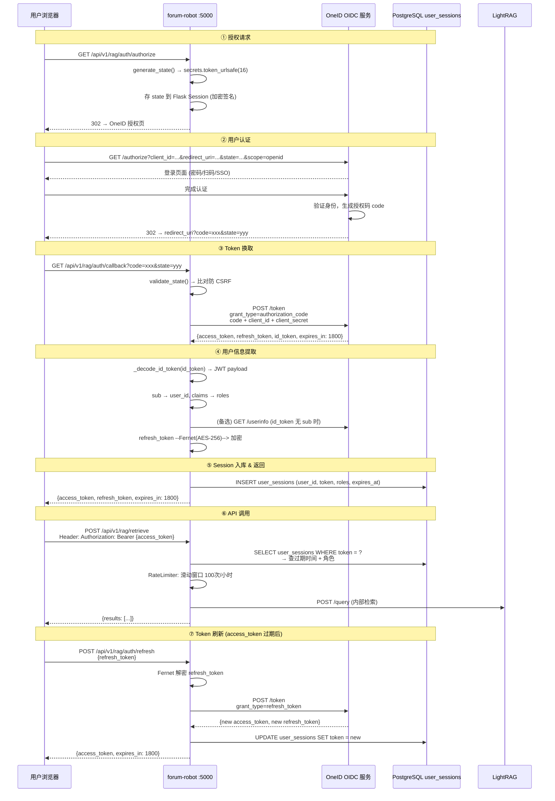

---
tags:
  - issue-921
  - 认证
  - OIDC
  - RAG
  - forum-reply-robot
issue: 921
service: forum-reply-robot
---

# Issue-921 RAG API — OIDC 认证完整机制与流程

> 关联：issue-921「openUBMC社区RAG支持对外查询接口」
> 协议：OpenID Connect 授权码模式（Authorization Code Flow）
> 认证方：OneID OIDC 服务

---

## 一、为什么需要 OIDC

RAG API 是对外开放的检索接口，必须知道"谁在调用"。不能自建用户体系（增加维护成本），所以接入已有统一认证 OneID。

OIDC 做了两件事：
1. **认证**：验证"你是谁" — 通过 OneID 确认用户身份
2. **授权**：确定"你能做什么" — 提取角色信息，RBAC 控制上传权限

---

## 二、授权码模式流程（6 步完整序列图）



---

## 三、六步详解

### 步骤 1：授权请求 — `authorize()` (`rag_api.py:66`)

```
用户 GET /api/v1/rag/auth/authorize
```

执行逻辑：
1. `generate_state()` — 调用 `secrets.token_urlsafe(16)` 生成 22 字符安全随机字符串
2. 存入 Flask Session（已用 `FLASK_SECRET_KEY` 加密签名，用户不可篡改）
3. 拼 OneID 授权 URL：
   ```
   https://omapi.osinfra.cn/oneid/oidc/authorize?
     client_id=672b25d8b92861baa16ce1e3&
     redirect_uri=https://lightrag.test.osinfra.cn/api/v1/rag/auth/callback&
     response_type=code&
     scope=openid profile&
     state={random_state}
   ```
4. 302 重定向 → 用户浏览器跳到 OneID

**安全要点**：`state` 参数防止攻击者构造恶意回调（CSRF）。回调时必须带上同一个 state，Flask Session 比对验证。

---

### 步骤 2：用户认证 — OneID 侧

OneID 收到授权请求后：
1. 展示登录页（密码/扫码/SSO，取决于 OneID 配置）
2. 用户完成认证后，OneID 生成一次性授权码 `code`（短期有效，通常 1-10 分钟）
3. 302 重定向回 `redirect_uri`：
   ```
   https://lightrag.test.osinfra.cn/api/v1/rag/auth/callback?
     code={authorization_code}&
     state={same_state}
   ```

---

### 步骤 3：Token 换取 — `auth_callback()` + `exchange_code_for_token()` (`rag_api.py:76`, `oidc_client.py:118`)

```
用户 GET /api/v1/rag/auth/callback?code=xxx&state=yyy
```

3.1 **state 校验** (`validate_state` — `oidc_client.py:91`)：
- 取出回调 URL 中的 `state` 参数
- 取出 Flask Session 中存储的 `oidc_state`
- 直接字符串比对，不匹配 → 400 `INVALID_STATE`（可能存在 CSRF 攻击）

3.2 **换 token** (`exchange_code_for_token` — `oidc_client.py:118`)：
```
POST https://omapi.osinfra.cn/oneid/oidc/token
Content-Type: application/x-www-form-urlencoded

grant_type=authorization_code
code={authorization_code}
redirect_uri=https://lightrag.test.osinfra.cn/api/v1/rag/auth/callback
client_id=672b25d8b92861baa16ce1e3
client_secret=d5b9e5650fe393f1b87e496567d9a21a
```

OneID 返回：
```json
{
  "access_token": "eyJhbGciOi...",
  "refresh_token": "eyJhbGciOi...",
  "id_token": "eyJhbGciOi...",
  "token_type": "Bearer",
  "expires_in": 1800
}
```

**关键参数说明**：
- `access_token`：API 调用凭证，有效期 30 分钟
- `refresh_token`：用于在 access_token 过期后换新，长有效期（7 天）
- `id_token`：JWT 格式，包含用户身份信息（OpenID Connect 特有，OAuth 2.0 没有）

---

### 步骤 4：用户信息提取 (`oidc_client.py:151-167`)

4.1 **解码 id_token** (`_decode_id_token` — `oidc_client.py:258`)：
- id_token 是 JWT（三段式 `xxxx.yyyy.zzzz`）
- 取第二段（payload），base64 补位后解码
- 提取 `sub`（subject，唯一用户标识）→ 作为 `user_id`
- 提取 claims 中的角色信息

4.2 **兜底：UserInfo 接口** (`_fetch_userinfo` — `oidc_client.py:280`)：
- 如果 id_token 没有 `sub`，调 `GET /userinfo`（携 `Authorization: Bearer {access_token}`）
- 从响应中获取用户标识和角色

4.3 **角色提取** (`_extract_roles_from_claims` — `oidc_client.py:308`)：
- 遍历 `rbac.role_claim_mapping` 配置，按 claim key 取值
- 示例映射：`huawei_maintainer → https://omapi.osinfra.cn/claims/roles`
- 也支持 `roles` 这个通用 claim

4.4 **Token 加密** (`_encrypt_token` — `oidc_client.py:335`)：
- `refresh_token` 用 Fernet (AES-256 + HMAC) 加密后存库
- 需要环境变量 `TOKEN_ENCRYPTION_KEY` 提供加密密钥
- 未配时不加密（仅警告），但强烈建议生产环境配置

---

### 步骤 5：Session 入库 (`auth_middleware.py:100`)

```sql
INSERT INTO user_sessions (user_id, access_token, refresh_token, token_expires_at, created_at, roles)
VALUES ('user_123', 'eyJhbG...', '<encrypted>', '2026-06-24 11:30:00', NOW(), '["huawei_maintainer"]')
```

库表 `user_sessions` 结构：

| 字段 | 类型 | 说明 |
|------|------|------|
| `id` | SERIAL PK | 自增主键 |
| `user_id` | VARCHAR(255) | 从 id_token sub claim 提取 |
| `access_token` | TEXT | API 调用凭证 |
| `refresh_token` | TEXT | Fernet 加密的刷新凭证 |
| `token_expires_at` | TIMESTAMP | 过期时间 (NOW + 1800s) |
| `created_at` | TIMESTAMP | 创建时间 |
| `updated_at` | TIMESTAMP | 更新时间 |
| `roles` | TEXT | JSON 数组，如 `["huawei_maintainer"]` |

---

### 步骤 6：后续 API 调用 — 认证链

```
用户 POST /api/v1/rag/retrieve
Header: Authorization: Bearer {access_token}
Body: { "query": "BMC 固件升级" }
```

**中间件调用链**（`rag_api.py:52-55`）：

```
require_auth  →  rate_limit  →  retrieve
     │                │              │
     ▼                ▼              ▼
提取 token        100次/小时      调 LightRAG
查 user_sessions   滑动窗口
校验过期时间       超限→429
提取角色 roles
```

`require_auth` 详细逻辑 (`auth_middleware.py:157`)：
1. `extract_token()` → 从 `Authorization: Bearer xxx` 头取 token
2. `validate_session(token)` → 查 `user_sessions` 表，校验存在 + 未过期
3. 把 `{user_id, roles, ...}` 注入 Flask `g.current_user`
4. token 缺失 → 401；token 过期 → 401；正常 → 继续

**上传接口额外 RBAC** (`rbac_middleware.py`)：
- 查 `g.current_user.roles` 是否包含 `huawei_maintainer` 或 `robot_service`
- 不在白名单 → 403 `ROLE_DENIED`

---

### 步骤 7：Token 刷新 (`rag_api.py:120`)

access_token 30 分钟过期后，用户不需要重新走授权流程：

```
POST /api/v1/rag/auth/refresh
{ "refresh_token": "<encrypted refresh_token>" }
```

1. `_decrypt_token()` — Fernet 解密数据库中的 refresh_token
2. `refresh_access_token()` — 调用 OneID `/token`，`grant_type=refresh_token`
3. OneID 返回新的 `access_token`（可选新的 refresh_token）
4. `update_session()` — 更新数据库中的 token 和过期时间

---

## 四、安全设计清单

| 安全点 | 威胁 | 实现 | 位置 |
|--------|------|------|------|
| **CSRF 防护** | 攻击者伪造回调请求获取 token | `state` 参数（`secrets.token_urlsafe(16)`）存入 Flask Session，回调时比对 | `oidc_client.py:83-103` |
| **Token 重放** | 过期 token 被截获后复用 | `access_token` 30 分钟过期，数据库校验 `expires_at` | `auth_middleware.py:72-74` |
| **Token 泄露** | 数据库泄露导致 refresh_token 被盗 | Fernet AES-256 加密存储，密钥配 `TOKEN_ENCRYPTION_KEY` | `oidc_client.py:335-361` |
| **暴力调用** | 恶意高频调用消耗资源 | 滑动窗口限流，PostgreSQL 计数器，100 次/小时/用户 | `rate_limiter.py` |
| **越权上传** | 普通用户调用知识上传 | RBAC 白名单：`rbac.knowledge_upload_roles` | `rbac_middleware.py` |
| **回放 state** | 攻击者复用同一个 state | 每次授权生成新 state，Flask Session 加密签名防篡改 | `oidc_client.py:83-89` |
| **路径穿越** | 上传文件名含 `../../` | `werkzeug.utils.secure_filename` 过滤 | `rag_api.py:326-331` |

---

## 五、关键配置

### 5.1 OIDC 配置（Vault 注入到 config.yaml）

| 配置项 | 测试环境值 | 说明 |
|--------|-----------|------|
| `oidc.client_id` | OneID 注册的测试应用 ID | Vault `infra-test/openeuler-discourse` → `robotConf` |
| `oidc.client_secret` | OneID 应用密钥 | 同上 Vault 注入 |
| `oidc.redirect_uri` | `https://lightrag.test.osinfra.cn/api/v1/rag/auth/callback` | 必须与 OneID 后台注册一致 |
| `oidc.authorize_url` | `https://omapi.osinfra.cn/oneid/oidc/authorize` | OneID 授权端点 |
| `oidc.token_url` | `https://omapi.osinfra.cn/oneid/oidc/token` | OneID token 端点 |
| `oidc.userinfo_url` | `https://omapi.osinfra.cn/oneid/oidc/userinfo` | OneID 用户信息端点 |
| `oidc.scope` | `openid profile` | 请求权限范围 |

### 5.2 OneID 侧注册要求

在 OneID 后台注册应用时，必须配置：
- **回调地址**：`https://lightrag.test.osinfra.cn/api/v1/rag/auth/callback`（与 config 一致）
- **授权类型**：Authorization Code Flow
- **scope**：openid, profile

### 5.3 Token 密钥

| 环境变量 | 必需 | 说明 |
|----------|------|------|
| `FLASK_SECRET_KEY` | 是 | Flask Session 加密签名密钥（32 字节随机字符串） |
| `TOKEN_ENCRYPTION_KEY` | 建议 | Fernet 加密 refresh_token 的密钥 |

---

## 六、错误码

| 端点 | 状态码 | 错误码 | 含义 |
|------|--------|--------|------|
| callback | 400 | `INVALID_STATE` | state 不匹配，可能是 CSRF 攻击 |
| callback | 500 | `OIDC_ERROR` | 换 token 失败 |
| refresh | 400 | `INVALID_REQUEST` | 请求体不是 JSON |
| refresh | 401 | `TOKEN_MISSING` | 缺少 refresh_token |
| refresh | 401 | `TOKEN_EXPIRED` | refresh_token 无效或已过期 |
| 所有 API | 401 | `TOKEN_MISSING` | 未带 access_token |
| 所有 API | 401 | `TOKEN_INVALID` | token 无效或已过期 |
| upload | 403 | `ROLE_DENIED` | 不在上传白名单 |
| 所有 API | 429 | `RATE_LIMITED` | 超限流阈值（100次/小时） |

---

## 七、生命周期

```
access_token   ──30分钟──▶  过期  ──refresh_token──▶  换新的 access_token
                                                                   │
refresh_token  ────7天───▶  过期  ──重新授权──▶  获取新 token 对
```

---

## 八、代码索引

| 文件 | 关键方法/行 | 职责 |
|------|------------|------|
| `src/ForumBot/oidc_client.py:26-39` | `__init__` | 读取配置 + 环境判断 |
| `src/ForumBot/oidc_client.py:68-81` | `_validate_config` | 配置完整性检查 |
| `src/ForumBot/oidc_client.py:83-103` | `generate_state` / `validate_state` | CSRF 防护 |
| `src/ForumBot/oidc_client.py:105-116` | `get_authorization_url` | 构造 OneID 授权 URL |
| `src/ForumBot/oidc_client.py:118-191` | `exchange_code_for_token` | code → token |
| `src/ForumBot/oidc_client.py:193-256` | `refresh_access_token` | refresh_token → 新 token |
| `src/ForumBot/oidc_client.py:258-278` | `_decode_id_token` | JWT payload 解码 |
| `src/ForumBot/oidc_client.py:308-333` | `_extract_roles_from_claims` | 角色提取 |
| `src/ForumBot/oidc_client.py:335-361` | `_encrypt_token` / `_decrypt_token` | Fernet 加解密 |
| `src/ForumBot/rag_api.py:66-74` | `authorize` | 授权入口 |
| `src/ForumBot/rag_api.py:76-118` | `auth_callback` | 回调处理 + token 入库 |
| `src/ForumBot/rag_api.py:120-166` | `refresh_token` | token 刷新 |
| `src/ForumBot/auth_middleware.py:38-45` | `extract_token` | 从 Header 提取 token |
| `src/ForumBot/auth_middleware.py:47-98` | `validate_session` | 查库校验 |
| `src/ForumBot/auth_middleware.py:100-126` | `save_session` | 入库 |
| `src/ForumBot/auth_middleware.py:157-181` | `require_auth` | 认证装饰器 |

---

## 🔗 相关笔记

- [[OIDC认证与常见认证手段]] — OIDC/OAuth/JWT 通用认证知识背景
- [[openUBMC RAG对外查询接口-架构设计说明书]] — 架构设计中引用了本认证机制
- [[issue-921-RAG对外域名全链路]] — 同 Issue：对外网络链路
- [[RAG对外API使用说明]] — 调用方视角的认证接入流程

> 专题索引：[[Issue 专题]] · 返回 [[首页]]
