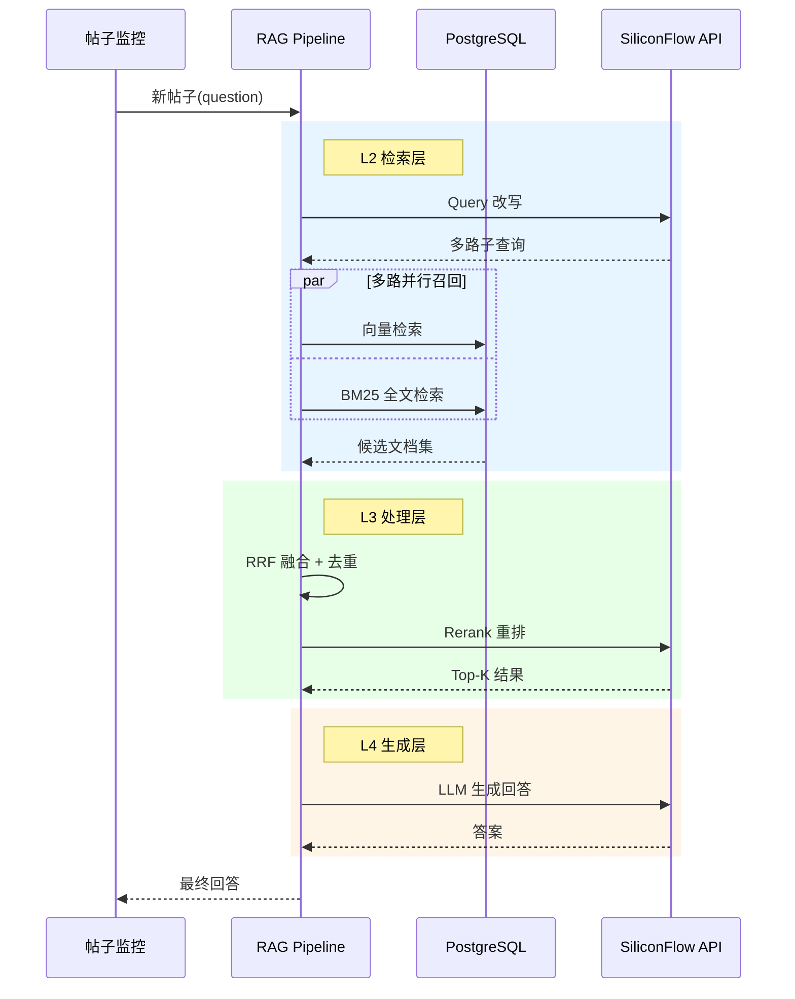
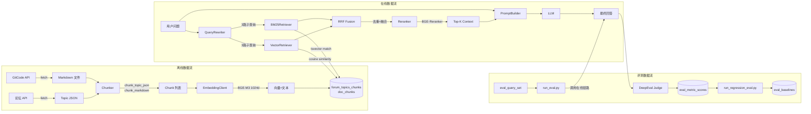
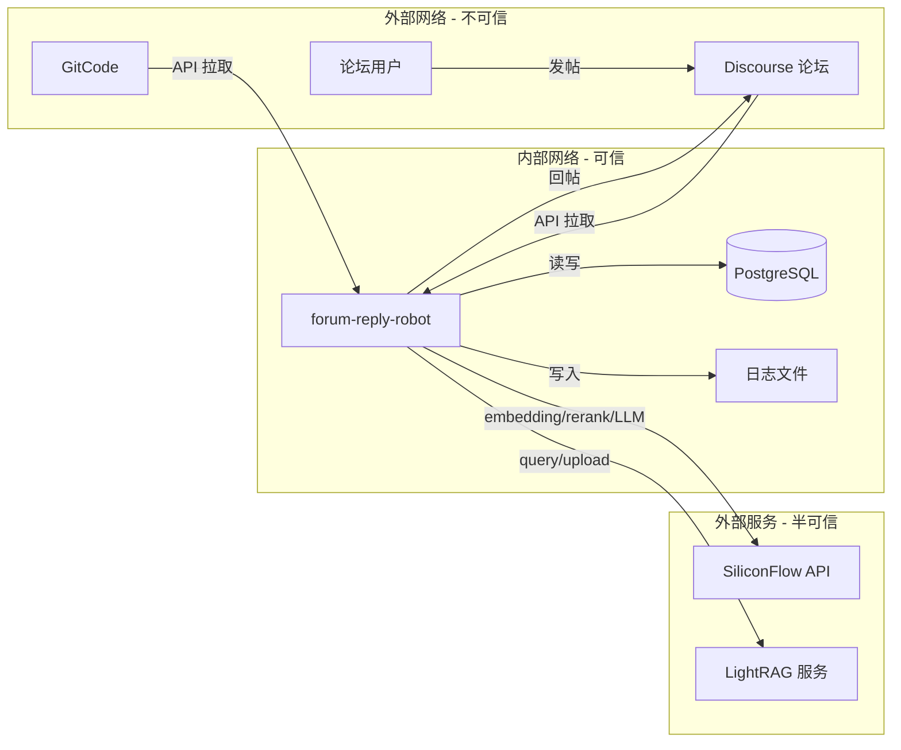

# forum-reply-robot RAG 系统模块化架构设计说明书

## 1. 基础信息

| 项目 | 内容 |
|---|---|
| 需求链接 | — |
| 需求名称 | openEuler 论坛智能回帖机器人 RAG 系统模块化重构与可持续看护 |
| 开发责任人 | 尹昱林 |
| 设计目标 | 将 RAG 系统按四层（数据准备/检索/处理/生成）物理解耦，集成结构化 tracing 和自动化回归测评，实现可持续看护 |

### 目标维度与量化指标

| 目标维度 | 量化指标 | 目标值 |
|---|---|---|
| 检索质量 | faithfulness（答案无幻觉） | ≥ 0.95 |
| 检索质量 | contextual_relevancy（检索切题） | ≥ 0.25 |
| 检索性能 | 检索延迟 p95 | < 500ms |
| 可观测性 | 关键节点 trace 覆盖率 | 100%（L2/L3/L4 全覆盖） |
| 可维护性 | 单元测试通过率 | 100%（346+ tests） |
| 可持续看护 | 回归检测自动化 | 指标退化 >5% 自动告警 |

---

## 2. 功能设计

### 2.1 架构图

#### 系统架构图

```mermaid
graph TB
    subgraph 数据源
        DS[Discourse 论坛 / GitCode 文档]
    end

    subgraph RAG Pipeline
        direction TB
        L1[L1 数据准备层<br/>采集 → 分块 → 向量化 → 入库]
        L2[L2 检索层<br/>Query改写 → 向量召回 + BM25 + 知识图谱]
        L3[L3 处理层<br/>RRF融合 → Rerank重排]
        L4[L4 生成层<br/>Prompt组装 → LLM生成]
    end

    subgraph 基础设施
        PG[(PostgreSQL<br/>pgvector + BM25)]
        SF[SiliconFlow API<br/>Embedding / Rerank / LLM]
    end

    subgraph 观测与评测
        OB[Tracing + 回归评测]
    end

    DS --> L1
    L1 --> PG
    L2 --> L3 --> L4
    L2 -.-> PG
    L2 -.-> SF
    L3 -.-> SF
    L4 -.-> SF
    OB -.-> L2
    OB -.-> L3
    OB -.-> L4
end
```

#### 在线请求时序图



### 2.2 数据流图



### 2.3 组件职责与接口

#### 新增组件

| 组件 | 路径 | 职责 | 接口 |
|---|---|---|---|
| `Retriever` Protocol | `src/rag/protocol.py` | L2 检索层契约 | `retrieve(query, *, top_k) -> List[RetrievalHit]` |
| `Processor` Protocol | `src/rag/protocol.py` | L3 处理层契约 | `process(query, hits, *, top_k) -> List[RetrievalHit]` |
| `Generator` Protocol | `src/rag/protocol.py` | L4 生成层契约 | `generate(question, context) -> GenerationResult` |
| `VectorRetriever` | `src/rag/retrieval/vector_retriever.py` | pgvector 向量召回 | `retrieve(query, top_k)` / `retrieve_multi(queries, top_k)` |
| `BM25Retriever` | `src/rag/retrieval/bm25_retriever.py` | PostgreSQL 全文检索 | `retrieve(query, top_k)` / `retrieve_multi(queries, top_k)` |
| `MultiQueryRewriter` | `src/rag/retrieval/query_rewriter.py` | Query 改写 | `rewrite(query) -> List[str]` |
| `RRFFusion` | `src/rag/processing/rrf_fusion.py` | RRF 融合+去重 | `process(query, hits, top_k)` |
| `Reranker` | `src/rag/processing/reranker.py` | BGE 重排 | `process(query, hits, top_k)` |
| `PromptBuilder` | `src/rag/generation/prompt_builder.py` | Prompt 模板组装 | `build(question, context) -> str` |
| `LLMClient` | `src/rag/generation/llm_client.py` | LLM 调用 | `generate(question, context) -> GenerationResult` |
| `RagPipeline` | `src/rag/pipeline.py` | 四层编排 | `run(question, top_k, chunk_top_k, enable_rerank, trace_ctx)` |
| `TraceContext` | `src/rag/tracing.py` | 追踪上下文 | `TraceContext.new(topic_id)` |
| `trace_event` | `src/rag/tracing.py` | 记录事件 | `trace_event(ctx, layer, event, **kwargs)` |
| `DualWriter` | `src/rag/ingestion/dual_writer.py` | 双写链路 | `sync_batch(file_paths) -> int` |

#### 修改组件

| 组件 | 修改内容 |
|---|---|
| `PgVectorAdapter` | 集成 RerankClient，enable_rerank 时调用 reranker |
| `ForumClient.retrieve_documents_for_topic` | 注入 TraceContext + trace_event |
| `RRFFusion.process` | 新增 3-gram 相似度去重 |

#### 数据类型

```python
@dataclass
class RetrievalHit:
    content: str        # chunk 文本内容
    score: float        # 相关性分数
    source: str         # 来源文件路径
    chunk_type: str     # question / best_answer / reply / doc
    metadata: Dict[str, Any]  # topic_id 等扩展信息

@dataclass
class GenerationResult:
    answer: str         # LLM 生成的答案
    prompt_tokens: int  # 输入 token 数
    completion_tokens: int  # 输出 token 数
    latency_ms: int     # 生成耗时
```

### 2.4 UX 设计

不涉及前端界面。本系统为后台自动化服务（论坛帖子监控 → 自动回帖），无直接用户交互界面。

运维人员通过以下方式操作：
- CLI 脚本：`run_eval.py`、`run_regression_eval.py`、`db_shell.py`
- 日志文件：`logs/trace.jsonl`（结构化 JSON，可接入日志平台）
- 数据库表：`request_traces`、`eval_baselines`（可接入 Grafana）

### 2.5 SOD 设计

不涉及。本系统为单一服务，不涉及多角色权限分离。所有操作（数据同步、检索、回帖）由同一服务账号 `euler_assistant` 执行。

### 2.6 功能设计分解 TASK 清单

| # | 任务描述 | 责任人 | 状态 |
|---|---|---|---|
| 1 | 定义四层 Protocol 接口（Retriever/Processor/Generator） | 尹昱林 | ✅ 完成 |
| 2 | 实现 Tracing 模块（TraceContext + trace_event + @traced） | 尹昱林 | ✅ 完成 |
| 3 | 实现 L2 检索层（VectorRetriever + BM25Retriever） | 尹昱林 | ✅ 完成 |
| 4 | 实现 L3 处理层（RRFFusion + Reranker） | 尹昱林 | ✅ 完成 |
| 5 | 实现 L4 生成层 + Pipeline 编排 | 尹昱林 | ✅ 完成 |
| 6 | 目录重组（ingest → ingestion）+ 兼容 re-export | 尹昱林 | ✅ 完成 |
| 7 | ForumClient 注入 Tracing + 回归测评脚本 | 尹昱林 | ✅ 完成 |
| 8 | eval_query_set 字段扩展 + 集成验证 | 尹昱林 | ✅ 完成 |
| 9 | 全量数据回填 + HNSW 索引 | 尹昱林 | ✅ 完成 |
| 10 | Query Rewriting（Multi-Query 策略） | 尹昱林 | ✅ 完成 |
| 11 | 上下文去重（3-gram Jaccard） | 尹昱林 | ✅ 完成 |
| 12 | 双写链路（DualWriter） | 尹昱林 | ✅ 完成 |
| 13 | 全量评测 + 对比报告 | 尹昱林 | 🔄 进行中 |
| 14 | 参数调优（rrf_k / top_k / rerank_top_n） | 尹昱林 | ⏳ 待完成 |
| 15 | 切换决策 + 生产部署 | 尹昱林 | ⏳ 待完成 |

---

## 3. 非功能设计

### 3.1 威胁分析

#### 数据流图与信任边界



#### 威胁建模（STRIDE）

| 威胁类型 | 威胁描述 | 影响组件 | 风险等级 |
|---|---|---|---|
| **S** 仿冒 | 攻击者伪造论坛帖子触发机器人回复恶意内容 | ForumClient | 中 |
| **T** 篡改 | 中间人篡改 SiliconFlow API 返回的 embedding/答案 | EmbeddingClient, LLMClient | 低 |
| **R** 抵赖 | 无法追溯某次回帖是由哪个 trace 链路产生 | Tracing | 低（已有 trace_id） |
| **I** 信息泄露 | config.yaml 中的 API Key 泄露 | 配置管理 | 高 |
| **D** 拒绝服务 | SiliconFlow API 限流/超时导致服务不可用 | 全链路 | 中 |
| **E** 权限提升 | Prompt Injection：用户在帖子中注入指令操控 LLM 输出 | AIProcessor | 高 |

### 3.2 安全设计实现

| 威胁 | 缓解措施 | 实现状态 |
|---|---|---|
| Prompt Injection | `check_prompt_injection()` 前置检测 + 系统 prompt 约束 | ✅ 已实现 |
| API Key 泄露 | 启动后删除 config.yaml（`delete_config_file()`） | ✅ 已实现 |
| 中间人攻击 | HTTPS 通信（SiliconFlow 默认 HTTPS） | ✅ 已实现 |
| 拒绝服务 | 重试机制（embedding 3 次、rerank 3 次）+ 超时控制 | ✅ 已实现 |
| 仿冒帖子 | 标签过滤（`required_tag`）+ 关键词过滤（`filter_keywords`） | ✅ 已实现 |
| 答案质量 | `check_answer_relevance()` 答案相关性校验 | ✅ 已实现 |

#### 3.2.1 安全任务分解

| # | 安全任务 | 责任人 | 状态 |
|---|---|---|---|
| 1 | Prompt Injection 检测（前置 gate） | 尹昱林 | ✅ |
| 2 | API Key 运行时保护（启动后删除配置文件） | 尹昱林 | ✅ |
| 3 | 答案质量 gate（相关性校验） | 尹昱林 | ✅ |
| 4 | 重试 + 超时 + 优雅降级 | 尹昱林 | ✅ |
| 5 | 结构化审计日志（trace_id 可追溯） | 尹昱林 | ✅ |

### 3.3 可靠性与可恢复性评估及设计

| 维度 | 设计 | 实现 |
|---|---|---|
| 服务存活 | Flask `/health` + `/health/detail` 健康检查 | ✅ |
| 检索降级 | pgvector 失败时返回空 context，LLM 仍可基于通用知识回答 | ✅ |
| Rerank 降级 | reranker API 失败时 fallback 到 RRF 原始排序 | ✅ |
| LLM 降级 | 主模型失败时可切换 model2_name（DeepSeek-V3.2） | ✅ |
| 数据持久化 | PostgreSQL WAL + 定期备份 | 运维层面 |
| 配置恢复 | config.yaml.local-bak / .startup-bak 多份备份 | ✅ |
| 增量同步 | 删除旧文档 → 上传新文档（有短暂检索空窗） | 已知限制 |

### 3.4 可观测性与可看护性评估及设计

| 维度 | 设计 | 实现 |
|---|---|---|
| 结构化日志 | JSON Lines 格式输出到 `logs/trace.jsonl` | ✅ |
| trace_id | UUID 贯穿单次请求全链路（L2→L3→L4） | ✅ |
| 分阶段延迟 | `request_traces` 表记录 retrieval/processing/generation 各阶段耗时 | ✅ |
| Token 追踪 | `consume_tokens_topic` 表记录每次 LLM 调用的 token 消耗 | ✅ |
| 离线评测 | deepeval 4 指标 + `eval_baselines` 趋势归档 | ✅ |
| 回归检测 | `run_regression_eval.py` 自动对比 baseline | ✅ |
| 用户反馈 | `user_feedback` 表收集点赞/踩数据 | ✅ 表就绪 |
| Prometheus | 预留 `/metrics` 端点，`request_traces` 表可接入 Grafana | 预留 |

### 3.6 性能及伸缩性评估及设计

#### 性能基线（2026-05-19，20 条 query）

| 指标 | pgvector（含 rerank） | LightRAG |
|---|---|---|
| 检索延迟均值 | 529ms | 45,423ms |
| 检索延迟 p95 | 626ms | 54,671ms |
| 答案生成延迟均值 | 35,586ms | 42,323ms |
| faithfulness | 0.905 | 0.958 |
| contextual_relevancy | 0.237 | 0.258 |

#### 伸缩性设计

| 维度 | 当前 | 扩展方案 |
|---|---|---|
| 数据量 | 478 chunks | HNSW 索引已建，支持百万级 |
| 并发 | 单线程轮询 | Flask + Gunicorn 多 worker |
| 检索延迟 | ~500ms（含 rerank） | 关闭 rerank 可降至 ~250ms |
| Embedding | SiliconFlow 单点 | 可切换本地部署 BGE-M3 |
| 存储 | 单 PG 实例 | PG 读写分离 / 分片 |

### 3.7 开源/第三方组件选型评估及设计

#### psycopg2-binary（PostgreSQL 驱动）

| 维度 | 评估 |
|---|---|
| 功能匹配度 | 完全满足：支持 pgvector 扩展、tsvector 全文检索、连接池 |
| 活跃度 | 高：持续维护，月均 commit 10+，issue 响应 <48h |
| 成熟度 | 极高：v2.9+，20 年历史，Python PG 驱动事实标准 |
| 文档质量 | 优秀：完整 API 文档 + 大量社区教程 |
| 许可证 | LGPL-3.0，商业友好 |
| 性能 | C 扩展实现，性能优于纯 Python 方案 |
| 安全性 | 无已知高危 CVE，参数化查询防 SQL 注入 |
| 可维护性 | 单一职责，API 稳定 |
| 生态 | SQLAlchemy/Django ORM 底层驱动 |
| 技术断供风险 | 无：开源社区维护，无地缘限制 |
| 许可证风险 | 无：LGPL 允许商业使用 |

#### pgvector（PostgreSQL 向量扩展）

| 维度 | 评估 |
|---|---|
| 功能匹配度 | 完全满足：1024 维向量存储、cosine/L2/IP 距离、HNSW 索引 |
| 活跃度 | 极高：GitHub 12k+ stars，周均 commit 5+，核心维护者活跃 |
| 成熟度 | 高：v0.7+，被 Supabase/Neon 等生产环境广泛使用 |
| 文档质量 | 良好：README + 多语言示例 |
| 许可证 | PostgreSQL License（类 MIT），商业友好 |
| 性能 | HNSW 索引 recall@10 > 95%，百万级数据 <10ms |
| 安全性 | 随 PostgreSQL 安全更新，无独立 CVE |
| 可维护性 | 纯 C 扩展，与 PG 版本同步 |
| 生态 | LangChain/LlamaIndex/Haystack 原生支持 |
| 技术断供风险 | 无：开源，可自行编译 |
| 许可证风险 | 无 |

#### deepeval（RAG 评测框架）

| 维度 | 评估 |
|---|---|
| 功能匹配度 | 高：Faithfulness/Relevancy/Precision/Recall 四指标，支持自定义 Judge LLM |
| 活跃度 | 高：GitHub 4k+ stars，周均 commit 10+，Discord 社区活跃 |
| 成熟度 | 中：v1.x，API 偶有 breaking change |
| 文档质量 | 良好：官方文档 + Jupyter 示例 |
| 许可证 | Apache-2.0，商业友好 |
| 性能 | 依赖 LLM 调用，性能取决于 Judge 模型 |
| 安全性 | 无已知 CVE |
| 可维护性 | Python 纯包，依赖较多（pydantic/openai 等） |
| 生态 | 与 OpenAI/Anthropic/自定义 LLM 集成 |
| 技术断供风险 | 低：开源，核心逻辑可自行实现 |
| 许可证风险 | 无 |

#### BAAI/bge-m3（Embedding 模型）

| 维度 | 评估 |
|---|---|
| 功能匹配度 | 高：1024 维，支持中英文，多语言 MTEB 排名前列 |
| 活跃度 | 高：HuggingFace 下载量 100M+，持续更新 |
| 成熟度 | 高：v1.5+，被大量生产系统使用 |
| 文档质量 | 良好：论文 + HuggingFace Model Card |
| 许可证 | MIT，商业友好 |
| 性能 | 通过 SiliconFlow API 调用，延迟 ~100ms/batch |
| 安全性 | 模型本身无安全风险，API 通信走 HTTPS |
| 可维护性 | 通过 API 调用，无本地部署维护成本 |
| 生态 | LangChain/LlamaIndex/Sentence-Transformers 支持 |
| 技术断供风险 | 中：依赖 SiliconFlow API，可切换本地部署 |
| 许可证风险 | 无 |

#### BAAI/bge-reranker-v2-m3（Rerank 模型）

| 维度 | 评估 |
|---|---|
| 功能匹配度 | 高：cross-encoder 重排，中英文效果优秀 |
| 活跃度 | 高：HuggingFace 下载量 10M+ |
| 成熟度 | 高：v2 版本，MTEB Reranking 排名前列 |
| 文档质量 | 良好：论文 + API 文档 |
| 许可证 | MIT，商业友好 |
| 性能 | API 调用 ~200ms/10 docs |
| 安全性 | 同 BGE-M3 |
| 可维护性 | 同 BGE-M3 |
| 生态 | 同 BGE-M3 |
| 技术断供风险 | 中：同 BGE-M3，可切换本地部署 |
| 许可证风险 | 无 |
